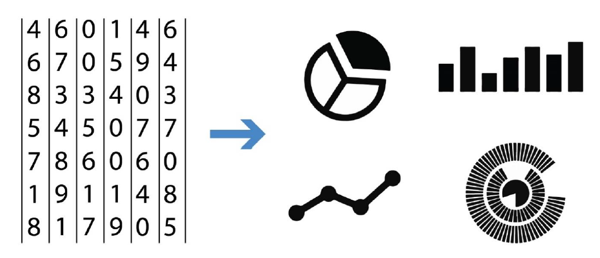
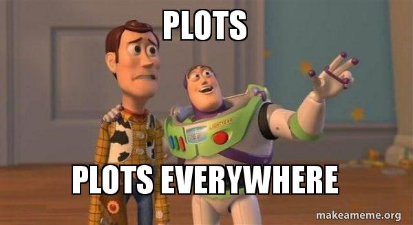

layout: true

<div class="my-header"></div>

<div class="my-footer"><span>
Kevin Rue-Albrecht
&emsp;&emsp;&emsp;&emsp;&emsp;&emsp;&emsp;&emsp;&emsp;
Statistics and Machine Learning in <i class="fab fa-r-project"></i>
</span></div>

```{r setup, include = FALSE}
stopifnot(requireNamespace("htmltools"))
htmltools::tagList(rmarkdown::html_dependency_font_awesome())
knitr::opts_chunk$set(
  message = FALSE, warning = FALSE, error = FALSE,
  include = FALSE
)
```

```{r, load_refs, include=FALSE, cache=FALSE}
options(htmltools.dir.version = FALSE)
library(RefManageR)
BibOptions(
  check.entries = FALSE,
  bib.style = "authoryear",
  cite.style = "authoryear",
  max.names = 2,
  style = "markdown",
  hyperlink = "to.doc",
  dashed = TRUE)
bib <- ReadBib("bibliography.bib")
```

---

# Set up

<br/>

.x-large-list[
- A clone of a personal GitHub repository for this course.

- A clone of a shared GitHub repository for this course.

- A working installation of R (4.0.3) including the `r BiocStyle::CRANpkg("renv")` package.

- A working installation of <i class="fab fa-git"></i>.

- A working installation of RStudio.
]

---

# Lesson goals and objectives

## Learning goals

.x-large-list[
- Describe how to build and display `r BiocStyle::CRANpkg("ggplot2")` figures.

- Understand the notion of aesthetics.

- Describe tidy data.
]

## Learning objectives

.x-large-list[
- Set up a project environment to work with `r BiocStyle::CRANpkg("ggplot2")`.

- Build and display, manage, and share `r BiocStyle::CRANpkg("ggplot2")` figures.
]

---

# Plots - Visualise and comprehend data

```{r, include=TRUE, echo=FALSE, fig.align='center'}

# Source: https://www.autodesk.com/autodesk-university/article/Turn-Revit-Data-Useful-Information-Visualization-Techniques-and-Workflows-2019
```

---

# Plots - Beyond summary statistics

```{r, include=TRUE, echo=FALSE, fig.align='center'}
knitr::include_graphics("img/plot-same-mean.gif")
# Source: https://www.variancereduction.com/single-post/2017/06/12/same-stats-different-graphs-the-importance-of-data-visualization
```

---

# Plots, plots everywhere!

```{r, include=TRUE, echo=FALSE, fig.align='center'}

# Source: https://makeameme.org/meme/plots-plots-everywhere
```

---

# Plotting in base <i class="fab fa-r-project"></i>

```{r, include=TRUE, fig.align='center', fig.height=4, fig.width=8}
hist(iris$Sepal.Length, breaks = 25, xlab = "Sepal Length",
  main = "Histogram of sepal lengths", col = "grey90", border = "red",
  xlim = c(4, 8), cex.lab = 1.5, cex.axis = 1.5, cex.main = 2)
```

```{r, include=TRUE}
head(iris$Sepal.Length)
```

---

# Further reading

## ggplot2

- 

## renv

- [Documentation (pkgdown)](https://rstudio.github.io/renv/)

---

# References

.small-text[
```{r, include=TRUE, echo=FALSE, results="asis"}
if (length(bib) > 0) {
  PrintBibliography(bib)
} else {
  cat("<p align='center'>n/a</p>")
}
```
]
