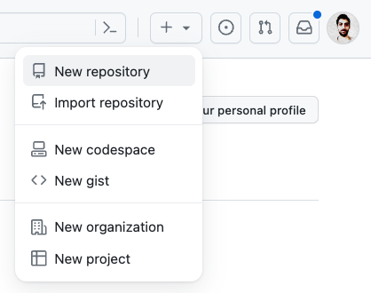
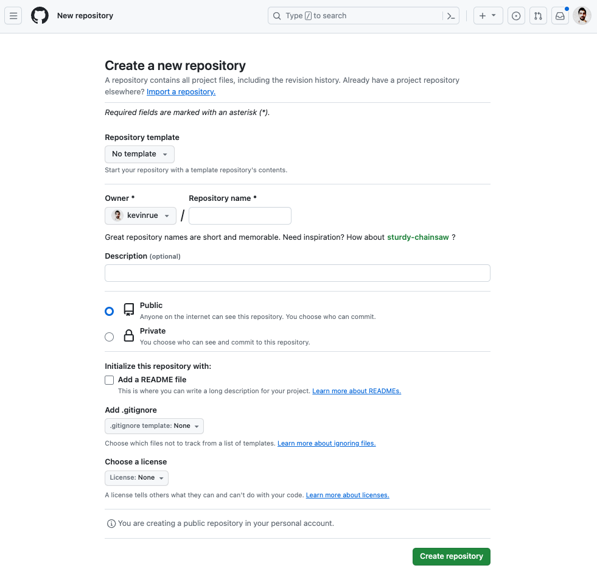
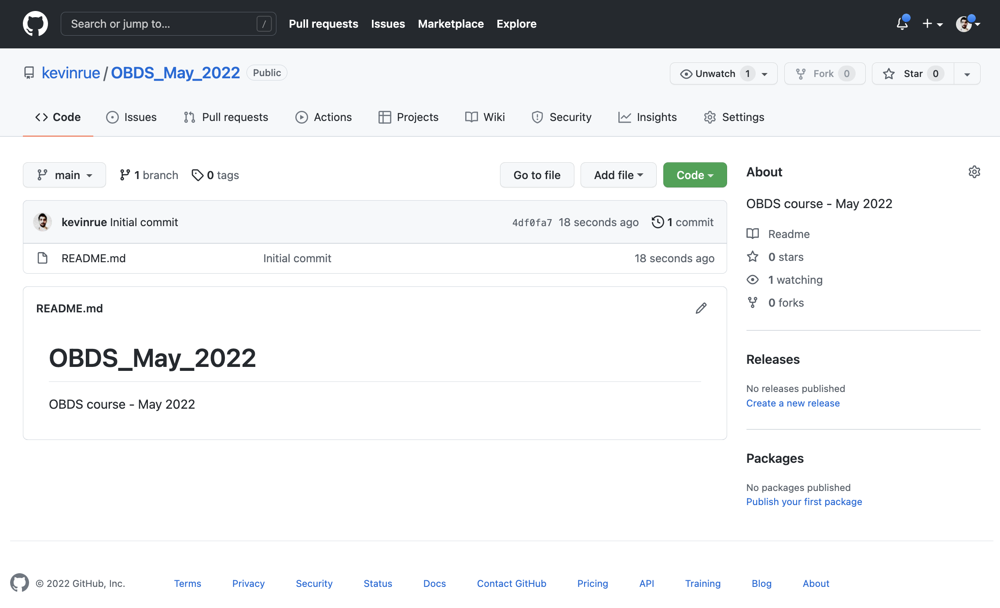

# Exercise

## Create a repository on <i class="fab fa-github"></i> GitHub

- Click on the `+` icon and then the `New Repository` menu item.

```{r, out.height='100px'}

# Source: Kevin Rue-Albrecht (screenshot)
```

---

# Exercise

## Create a repository on <i class="fab fa-github"></i> GitHub

```{r, out.height='500px'}

# Source: Kevin Rue-Albrecht (screenshot)
```

- Click `Create repository`.

---

# Exercise

## Create a repository on <i class="fab fa-github"></i> GitHub

The new repository - if initialised with a README file - should appear as follows.

```{r, out.height='400px'}

# Source: Kevin Rue-Albrecht (screenshot)
```
