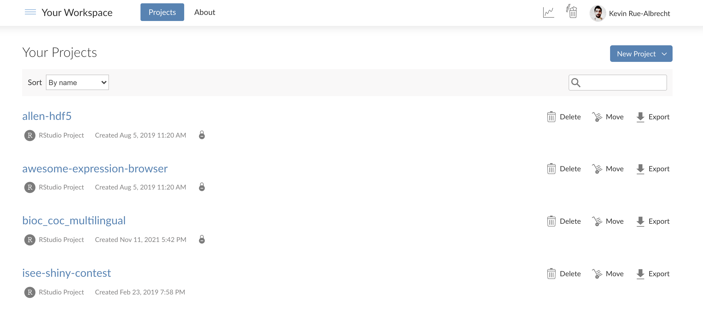

```{r child='layout.Rmd'}
```

---

# Learning Goals & Objectives

### Learning goals

<!--
High-level "big picture" objectives of the learning process.
-->

- Understand what version control is and when to use it.
- Identify where git stores information.
- Practice how to record changes in <i class="fab fa-git"></i>.

### Learning objectives

<!--
More concrete and measurable outputs.
-->

- Set up an SSH key pair.
- Configure <i class="fab fa-git"></i>.
- _Initialise_ a personal repository for this course, on <i class="fab fa-github"></i> GitHub.
- _Clone_ a copy of the repository on the teaching cluster.
- Create and edit files in the repository on the teaching cluster, and _commit_ those changes.
- _Push_ your changes to the <i class="fab fa-github"></i> GitHub clone of the repository.
- Edit files on the <i class="fab fa-github"></i> GitHub clone of the repository.
- _Pull_ updates from the <i class="fab fa-github"></i> GitHub clone to the clone of the repository on the teaching cluster.
- Examine the _log_ of the shared repository, on <i class="fab fa-github"></i> GitHub and on the teaching cluster.

---

# Pre-requisites

- A [<i class="fab fa-github"></i> GitHub](https://github.com/) account.

- Membership to the <i class="fab fa-github"></i> GitHub organisation [OBDS-Training](https://github.com/OBDS-Training).

- An [RStudio Cloud](https://rstudio.cloud/) account.

---

```{r child='opening.Rmd'}
```

---

# RStudio Cloud projects

```{r, fig.align='center', out.height='375px'}
# Screenshot

```

---

# Exercise

## Setting up an RStudio Cloud project

This RStudio Cloud project will be your workplace for the course.

- Navigate to <https://rstudio.cloud/> and sign in.

- Navigate to the Space `OBDS_September_2022`.

- Create a new RStudio project

  + "New Project" > "New RStudio Project".

- Name the project with your own name (e.g., `Kevin Rue`).

---

# SSH key pairs

```{r, fig.align='center', out.height='400px', out.width='600px'}
# Source: Adobe Illustrator

```

.center[
_We need to set an SSH key pair between RStudio Cloud and GitHub._
]

---

# Exercise

## Setting up the SSH key pair

This key pair will allow your RStudio Cloud project to push and pull code through the GitHub API.

- In your RStudio Cloud project, open the Terminal.

- Create an SSH key pair.

  + `ssh-keygen -t rsa -b 4096`
  
  + _Do_ set a passphrase to protect your key pair.

- Display the public key and copy it.

  + `cat ~/.ssh/id_rsa.pub`

- Add the public key to your GitHub account.

  + <https://github.com/settings/ssh/new>

.center[
_(See next slides to navigate to that page more naturally.)_
]

---

```{r child='ssh-keypair-screenshots.Rmd'}
```
