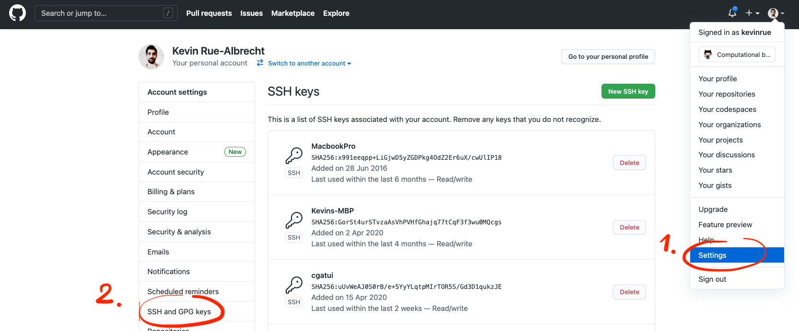
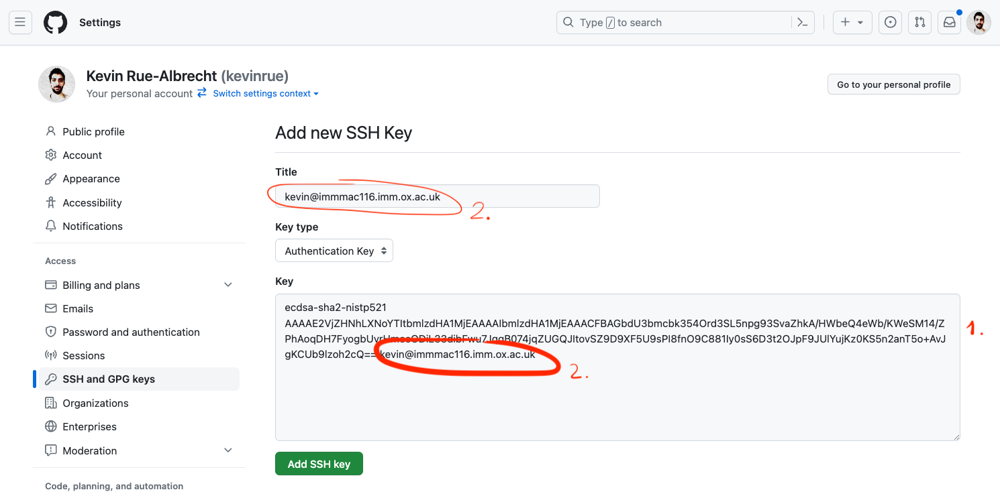

# Exercise

## Accessing the SSH keys settings on <i class="fab fa-github"></i> GitHub

```{r, fig.align='center', out.height='350px'}
# Screenshot

```

---

# Exercise

## Adding a new SSH key on <i class="fab fa-github"></i> GitHub

```{r, fig.align='center', out.height='350px'}
# Screenshot

```
