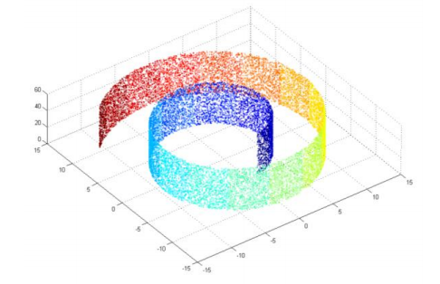
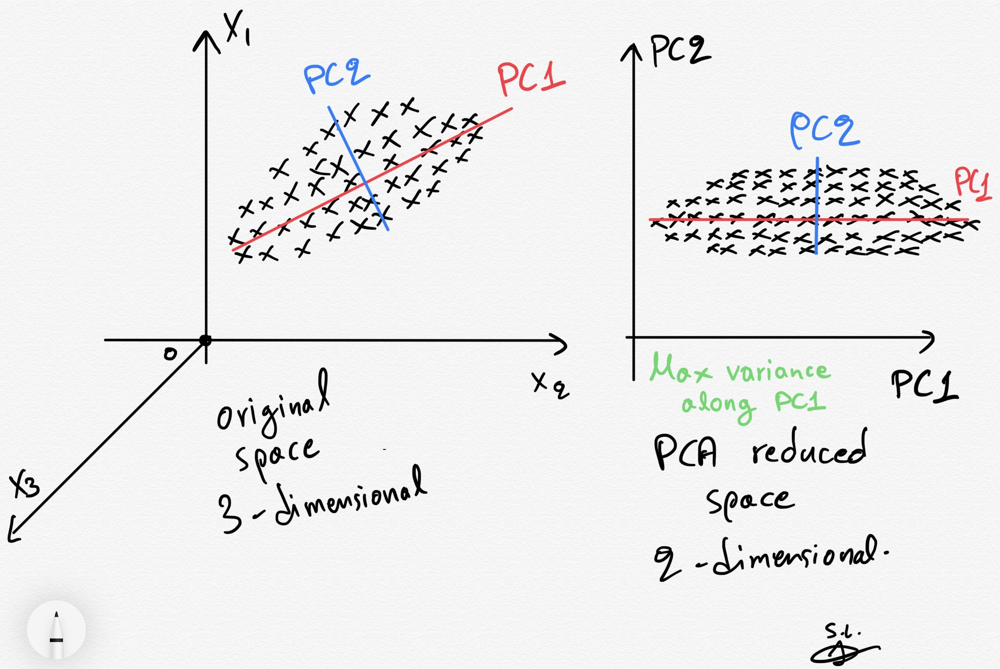

layout: true

<div class="my-header"></div>

<div class="my-footer"><span>
Kevin Rue-Albrecht
&emsp;&emsp;&emsp;&emsp;&emsp;&emsp;&emsp;&emsp;&emsp;&emsp;
Dimensionality reduction using <i class="fab fa-python"></i> Python
</span></div> 

```{r setup, include = FALSE}
stopifnot(requireNamespace("htmltools"))
htmltools::tagList(rmarkdown::html_dependency_font_awesome())
knitr::opts_chunk$set(
  message = FALSE, warning = FALSE, error = FALSE, include = TRUE, echo = FALSE,
  fig.align='center', out.height='500px'
)
options(width = 90)
stopifnot(require(base))
```

```{r, load_refs, include=FALSE, cache=FALSE}
options(htmltools.dir.version = FALSE)
library(RefManageR)
BibOptions(
  check.entries = FALSE,
  bib.style = "authoryear",
  cite.style = "authoryear",
  style = "markdown",
  hyperlink = "to.doc",
  dashed = TRUE)
bib <- ReadBib("bibliography.bib")
```

---

# Learning Objectives & Goals

## Learning Goals

- Understand what dimensionality reduction is.
- Describe when and how to use it.

## Objectives

- Apply various dimensionality reduction methods to a data set.
- Visualise the output of dimensionality reduction.

---

# Pre-requisites

.x-large-list[
- Access to the CCB cluster and the shared data folder.

- A working installation of <i class="fab fa-git"></i>.

- A clone of the shared <i class="fab fa-github"></i> GitHub repository for this course.

- A working installation of [Miniconda](https://docs.conda.io/en/latest/index.html).
]

---

# Credits

.center[
<i class="fab fa-github"></i> <https://github.com/mGalarnyk/Python_Tutorials>

Paul Brodersen
]

---

# What is dimensionality reduction?

.pull-left[
```{r}
x_nrow <- 10
x <- data.frame(
  V1 = rep(".", 10),
  V2 = rep(".", 10),
  V3 = rep(".", 10),
  V4 = rep(".", 10),
  V5 = rep(".", 10),
  V6 = rep(".", 10),
  row.names = paste0("sample", 1:x_nrow))
knitr::kable(x)
```
]

.pull-left[
```{r}
x_nrow <- 10
x <- data.frame(
  D1 = rep(".", 10),
  D2 = rep(".", 10),
  D3 = rep(".", 10),
  row.names = paste0("sample", 1:x_nrow))
knitr::kable(x)
```
]

---

# Why and when should you use dimensionality reduction?

```{r, echo=FALSE, out.height='400px'}
# Source: https://medium.com/analytics-vidhya/locally-linear-embedding-lle-data-mining-b956616d24e9

```

.center[
1. Visualisation
2. Interpretation
3. Compression
]

---

# How can we reduce dimensions?

## Method 1: Principal components analysis

```{r, echo=FALSE, out.height='400px'}
# Source: https://towardsdatascience.com/pca-clearly-explained-how-when-why-to-use-it-and-feature-importance-a-guide-in-python-7c274582c37e

```

---

# Set up

Use `conda.yml` to create a Conda environment for this exercise.

```{bash, echo=TRUE, eval=FALSE}
conda env create --file conda.yml --name obds-py-dimred
```

Activate the environment.

```{bash, echo=TRUE, eval=FALSE}
conda activate obds-py-dimred
```

Launch JupyterLab.

```{bash, echo=TRUE, eval=FALSE}
jupyter lab
```

Navigate to the sub-directory for today, and create a new notebook with your name,
e.g. `kevinrue.ipynb`.

---

# Import the data set

Import the `pandas` package like a pro!

```{python, echo=TRUE, eval=FALSE}
import panda as pd
```

.center[
**What does this line do? What are the consequences?**
]

--

Use the function `read_csv()` (in the `pandas` package) to import data from the file `iris.data`,
into a variable called `df`.

```{python, echo=TRUE, eval=FALSE}
df = ...
```

<!-- TODO: give them the path to the iris.data file on the cluster -->

.center[
**What are the default column names?**
]

--

Use the following list of column names.

```{python, echo=TRUE, eval=FALSE}
['sepal length','sepal width','petal length','petal width','target']
```

Display the first 5 rows of the data set.

---

# Standardise the data

> Standardise = Center and scale each feature measured in the data set.

.center[
**Why would we want to do this? Can we standardise _all_ the variables in this data set?**
]

--

## Split measurements from class labels

First, separate the numerical measurements and the classification labels in two separate variables,
`x` and `y`, respectively.

```{python, echo=TRUE, eval=FALSE}
x = ...
y = ...
```

#### Hints

- For a data frame `df`, you can use the property [`df.loc`](https://pandas.pydata.org/docs/reference/api/pandas.DataFrame.loc.html) to access rows and columns by label.
- You can use the symbol `:` alone to access _all_ the rows and/or columns.
- For a data frame `df`,  you can extract _values_ as an Numpy array using the property [`df.values`](https://pandas.pydata.org/docs/reference/api/pandas.DataFrame.values.html.

---

# Standardise the data

We will use the [`StandardScaler`](https://scikit-learn.org/stable/modules/generated/sklearn.preprocessing.StandardScaler.html) module in the `scikit-learn` package, to standardize features by removing the mean and scaling to unit variance.

```{python, echo=TRUE, eval=FALSE}
from sklearn.preprocessing import StandardScaler
```

.center[
**Where should you add this line?**
]

--

Use the method [`fit_transform()`](https://scikit-learn.org/stable/modules/generated/sklearn.preprocessing.StandardScaler.html#sklearn.preprocessing.StandardScaler.fit_transform) in the `StandardScaler` object to standardise the set of measurements (we called it `x`).
Re-assign the standardised data to the variable `x` (i.e., override the value of `x`).

.center[
**Compare the value of `x` in notebook cells before and after standardisation.**
]

--

#### Bonus point

Use `pd.DataFrane` to reconstruct a data frame from the new value of `x` and the names of the features measured.

You do not need to assign this to any variable.
The goal is simply to display the result nicely in the notebook.

---

# Apply PCA

We will use the [`PCA`](https://scikit-learn.org/stable/modules/generated/sklearn.decomposition.PCA.html) module in the `scikit-learn` library, to apply principal component analysis (PCA) to the data set.

```{python, echo=TRUE, eval=FALSE}
from sklearn.decomposition import PCA
```

.center[
**Where should you add this line?**
]

--

Running a PCA using `scikit-learn` generally involves two steps:

1. Use the `PCA` module to create an object (e.g. `pca`) that defines the parameters of the analysis.
  For instance, `PCA(n_components=2)` will request only the first two principal components of the analysis.
2. Use the `fit_transform()` function of the `pca` object to perform the analysis on the data set (what we called `x`).
  Assign the output of that function to a new variable `principalComponents`.

.center[
**What is the return value of the `fit_transform()` function?**
]

--

Use the return value of `fit_transform()` to create a `pandas.DataFrame` called `principalDf`, with two columns named "principal component 1" and "principal component 1".

```{python, echo=TRUE, eval=FALSE}
principalDf = ...
```

---

# Visualise the PCA projection

We will use the [`pyplot`](https://matplotlib.org/2.0.2/api/pyplot_api.html) module in the `matplotlib` library, to construct a scatter plot of the first two principal components.

```{python, echo=TRUE, eval=FALSE}
import matplotlib.pyplot as plt
```

.center[
**Where should you add this line?**
]

#### Hints

- Initialise a new figure.
- Initialise a new figure panel.
- Set the two axis labels and the plot title.
- Draw a scatter plot of the two principal components.
- Display grid lines in the background.

#### Bonus point

Color data points according to their class label. (**Recommendation:** use a separate notebook cell).

- Use the function `pd.concat()` to add the class label to the data frame (we called it `principalDf`).
- Use a `for` loop to iteratively add data points from each class label.

---

# Variance explained by PCA

The variance explained by each principal component is stored in the `pca` object that we used to apply PCA to the data set.

```{python, echo=TRUE, eval=FALSE}
pca.explained_variance_ratio_
```

.center[
**Running PCA without standardisation yielded the following variance explained for the first two components. How do you compare this with your results?**
]

```
array([0.92461621, 0.05301557])
```

---

# To do

- Identify packages that we will use.
  + Dimensionality reduction (e.g., PCA, UMAP, t-SNE).
    * UMAP
    * t-SNE

- Clarify how we will use python on the cluster.

---

# Further reading

## Novice

- <https://swcarpentry.github.io/python-novice-inflammation/>

## Advanced

- <https://pandas.pydata.org/>
- <https://scikit-learn.org/stable/>
- <https://matplotlib.org/stable/>

---

# References

```{r refs, results="asis"}
PrintBibliography(bib)
```

???

Extras:

- Install `git`
- `git init` (as opposed to `git clone`)
- `git merge` vs `git rebase`
