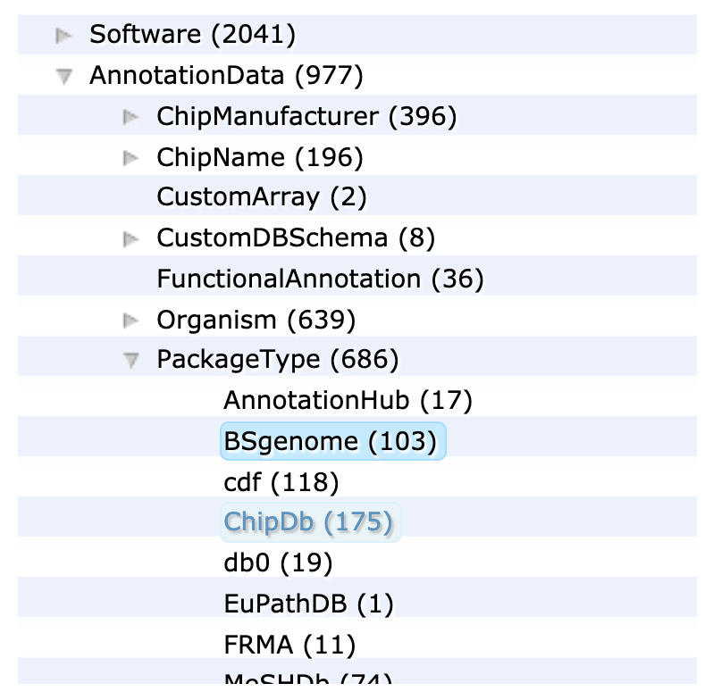

# BSgenome packages

Bioconductor provide genome sequences for a range of model organisms and their incremental versions over time.

.pull-left[
```{r, include=TRUE, echo=FALSE}
## Source: https://bioconductor.org/help/course-materials/2019/CSAMA/L1.4-bioc-data-representation.html

```
]

.pull-right[
- The `r BiocStyle::Biocpkg("BSgenome")` package provides core functionality.

- Other package names start with `"BSgenome."`

  + e.g. `BSgenome.Hsapiens.UCSC.hg19`
]
