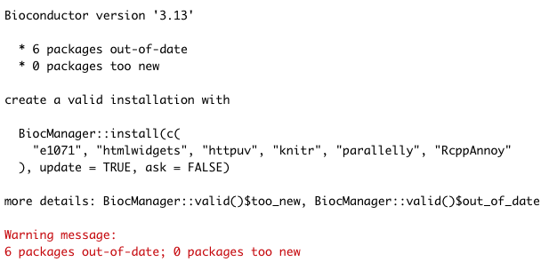
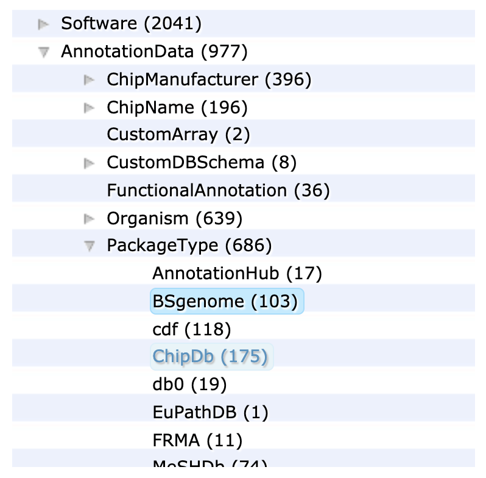
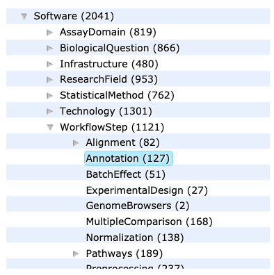
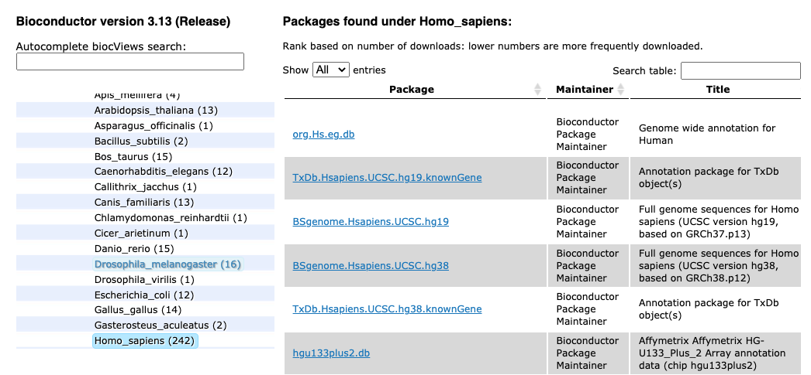

layout: true

<div class="my-header"></div>

<div class="my-footer"><span>
Kevin Rue-Albrecht
&emsp;&emsp;&emsp;&emsp;&emsp;&emsp;&emsp;&emsp;&emsp;&emsp;
Introduction to Bioconductor
</span></div> 

```{r setup, include = FALSE}
stopifnot(requireNamespace("htmltools"))
htmltools::tagList(rmarkdown::html_dependency_font_awesome())
knitr::opts_chunk$set(
  message = FALSE, warning = FALSE, error = FALSE,
  include = FALSE
)
options(width = 90)
stopifnot(require(tidyverse))
```

```{r, load_refs, include=FALSE, cache=FALSE}
options(htmltools.dir.version = FALSE)
library(RefManageR)
BibOptions(
  check.entries = FALSE,
  bib.style = "authoryear",
  cite.style = "authoryear",
  max.names = 2,
  style = "markdown",
  hyperlink = "to.doc",
  dashed = TRUE)
bib <- ReadBib("bibliography.bib")
```

---

# Lesson goals and objectives

## Learning goals

- Describe the Bioconductor project beyond software packages.

- Identify  best practices to get help from packages developers and peers.

- Identify classes and methods re-used across Bioconductor packages.

## Learning objectives

- Bookmark online websites where help can be found.

- Install core Bioconductor packages and workflow-specific packages.

- Create Bioconductor objects and access their contents.

---

# Prerequisites

<br/>

.x-large-list[
- A clone of the shared GitHub repository for this course.

- A working installation of [R](https://www.r-project.org/) (4.1).

- A working installation of [git](https://git-scm.com/).

- A working installation of [RStudio](https://rstudio.com/).
]

---

# Set up

- Pull the `master` branch of the shared repository.

> We have added some files to get you started.

- In the daily sub-directory, make a copy of the `template` sub-directory with your username.

> e.g. `cp -R template kevinrue`

The resulting file structure should look like the following:

```
  OBDS_Training_May_2021/
  |_ 3_r_stats_genomics/
    |_ 3_bioconductor/
      |_ template
        |_ ... (files)
      |_ kevinrue (copied from 'template')
        |_ ... (files)
        |_ bioconductor.Rproj
```

- Launch the RStudio project `bioconductor.Rproj` in your own sub-directory.

---

# Bioconductor resources and help

```{r, include=TRUE, echo=FALSE, out.height="100px", out.width="350px", fig.align="center"}
knitr::include_graphics("https://www.bioconductor.org/images/logo/jpg/bioconductor_logo_cmyk.jpg")
```

- Main website: <https://www.bioconductor.org/>

- Support site: <https://support.bioconductor.org/>

- Courses & Conferences materials: <https://www.bioconductor.org/help/course-materials/>

- YouTube videos: <https://www.youtube.com/user/bioconductor>

- Books: <http://www.bioconductor.org/books/release/>

- Slack workspace: <https://bioc-community.herokuapp.com/>

- ... and more! Can you think of others? <i class="far fa-smile"></i>

---

# Project objectives

.center[
**Analysis and comprehension of high-throughput genomic data**
]

- Statistical analysis: large data, technological artifacts, designed experiments; rigorous, robust.

- Comprehension: biological context, visualization, reproducibility.

- High-throughput.

  + Sequencing: RNA-seq, ChIP-seq, variants, copy number, ...

  + Microarrays: gene expression, SNP, ...

  + Flow cytometry, proteomics, images, ...

.footnote[
Credits: [Introduction to R / Bioconductor (2016)](https://bioconductor.org/help/course-materials/2016/BiocIntro-May/B1_Bioconductor_Intro.html) by Martin Morgan
]

---

# Bioconductor packages in a workflow

```{r, include=TRUE, echo=FALSE, out.height='450px', out.width='800px'}
knitr::include_graphics("img/workflow-steps-packages.png")
```

.footnote[
Credits: [Introduction to R / Bioconductor (2019)](https://www.bioconductor.org/help/course-materials/2019/CSAMA/L1.3-starting-an-analysis.html) by Martin Morgan
]

---

# Bioconductor release 3.13

- Contents

  + 2042 software packages
  + 406 experiment data packages
  + 965 annotation packages
  + 29 workflows

- Updates

  + 133 new software packages
  + 22 new data experiment packages
  + 7 new annotation packages
  + 1 new workflow
  + no new books

- Compatibility

   + Bioconductor 3.13 is compatible with R 4.1.0
   + Supported on Linux, 32- and 64-bit Windows, and macOS 10.14.6 Mojave or higher
   + This release will include an updated Bioconductor Docker container.

Source: <https://bioconductor.org/news/bioc_3_13_release/>

---

# Finding packages and information

- Discover and navigate packages via [biocViews](https://www.bioconductor.org/packages/devel/BiocViews.html).

  + Filter: Software, Annotation, Experiment, Workflow, ...

- Learn more on the [package landing page](https://bioconductor.org/packages/release/bioc/html/Biobase.html)

  + Title, author / maintainer, short description, citation, installation instructions, …, download statistics.

- All user-visible functions have help pages, most with runnable examples.

  + Learn by doing on a minimal example; positive control; sanity check.

- Vignettes

  + Narrative documents illustrating how to use the package, integrating code in a workflow, e.g. `browseVignettes("Biobase")`.

- Release cycle

  + Every six months; development takes place on a separate branch of the repository.

???

**Source:**

- [Introduction to R / Bioconductor (2019)](https://www.bioconductor.org/help/course-materials/2019/CSAMA/L1.3-starting-an-analysis.html) by Martin Morgan

---

# Exercise

## Exploring software packages

- Visit the listing of packages on the Bioconductor [biocViews](https://bioconductor.org/packages/release/BiocViews.html) web page.

- Use the `Autocomplete biocViews search` box in the upper left to identify packages that have been tagged for RNA sequencing analysis.

- Explore other analysis like ChIP-seq, epigenetics, variant annotation, proteomics, single-cell genomics, etc.

- Explore the graph of software packages by expanding and contracting individual terms.

- In the RNA-seq category, find out which of `DESeq2` and `edgeR` is more popular, and go to their landing page.

- Briefly explore the vignette and reference manual links.

.center[
**When would you consult the vignette? When would the reference manual be helpful?**
]

.footnote[
Credits: [Introduction to R / Bioconductor (2019)](https://www.bioconductor.org/help/course-materials/2019/CSAMA/L1.3-starting-an-analysis.html) by Martin Morgan
]

---

# Exercise

## Exploring annotation packages

- Visit the listing of packages on the Bioconductor [biocViews](https://bioconductor.org/packages/release/BiocViews.html) web page.

- Click on the `AnnotationData` top-level term.

- Search, using the box on the right-hand side, for annotation packages that start with the following letters to get a sense of the packages and organisms available.

  + `org.`: symbol mapping
  + `TxDb.` and `EnsDb.`: gene models
  + `BSgenome.`: reference genomes

## Exploring workflow packages

Workflow packages are meant to provide a comprehensive introduction to workflows that require several different packages.
These can be quite extensive documents, providing a very rich source of information.

- Briefly explore the ‘Simple Single Cell’ workflow (or other workflow relevant to your domain of interest) to get a sense of the material the workflow covers.

???

Source:

- [Introduction to R / Bioconductor (2019)](https://www.bioconductor.org/help/course-materials/2019/CSAMA/L1.3-starting-an-analysis.html) by Martin Morgan

---

# The Bioconductor philosophy

- Common data structures

  + e.g., `DNAStringSet`, `GRanges`, `GAlignments`, `SummarizedExperiment`, `TxDb`

  + High standards of software engineering; [Core team](https://www.bioconductor.org/about/core-team/).

  + Reduce redundancy; Promotes interoperability.

  + ..., but community adoption can take time.

--

- Release cycle every 6 months (April, October)

  + Packages on the _release_ branch are stable for at least 6 months.
    Active development takes place on the _devel_ branch.
  
  + ..., but new features can take up to 6 months to be released (_devel_ $\rightarrow$ _release X.Y_).

--

- New packages are thoroughly reviewed by members of the core team

  + Packages are submitted as issues on <i class="fa fa-github"></i> [Bioconductor/Contributions](https://github.com/Bioconductor/Contributions)
  
  + Review and fixes can take time, but accepted packages are generally high quality!

???

**Source:**

- [Introduction to R / Bioconductor (2019)](https://www.bioconductor.org/help/course-materials/2019/CSAMA/L1.3-starting-an-analysis.html) by Martin Morgan

---

# Bioconductor uses the S4 class system

.pull-left[
- Best practice: classes and methods implemented in a dedicated package.

- Formal definition: parent class (optional), new slot names and types.

- Internal validity checking method.

- Methods and generics implemented outside the class definition.

  + "What can I do with this object?"

```{r, include=TRUE, results='hide'}
setClass("Person",
  representation(
    name = "character",
    age = "numeric")
  )
```

Source: <http://adv-r.had.co.nz/S4.html>
]

.pull-right[
```{r}
Person <- function(name, age) {
  new("Person", name = name, age = age)
}
```

```{r, include=TRUE}
kevin <- Person(name = "Kevin", age = 21)
kevin
```

```{r, include=TRUE}
kevin@age # don't do that
```

```{r}
get_age <- function(object) {
  object@age
}
```

```{r, include=TRUE}
get_age(kevin) # do that (if possible)
```
]

---

# Exercise

## Install Bioconductor

- Install the `r BiocStyle::CRANpkg("BiocManager")` package from CRAN.

- Install the package `r BiocStyle::Biocpkg("Biostrings")` using `BiocManager::install()`.

- Run the function `BiocManager::valid()`.
  What does it do?

## Use Bioconductor packages and help pages

- Load the `r BiocStyle::Biocpkg("Biostrings")` package.

- The `r BiocStyle::Biocpkg("Biostrings")` package provides the object `DNA_ALPHABET`.
  Print the object in the console and use the help page to explain the value of the object.

- The `r BiocStyle::Biocpkg("Biostrings")` package provides the function `letterFrequency()`.
  Run some code from the "Examples" section of the help page, and describe what the function does.

- Access the package vignette(s).
  How many vignette does the `r BiocStyle::Biocpkg("Biostrings")` package include?

- Import sequences in the file `TruSeq3-PE-2.fa`.
  What is the class of the object?

---

# Updating Bioconductor packages

```{r, include=TRUE, echo=FALSE}

```

---

# Exercise

## BiocManager repositories

- Run `options("repos")`.
  What do you see?

The function `options()` can be used to get or set global options of the current <i class="fab fa-r-project"></i> session.

- Run `BiocManager::repositories()`.

The function returns a character vector that combines the URL of Bioconductor package repositories with those already present in `options("repos")`.

- In the `.Rprofile` file, add the following line and restart the <i class="fab fa-r-project"></i> session.

```{r}
options(repos = BiocManager::repositories())
```

- Run `options("repos")` again in your freshly opened <i class="fab fa-r-project"></i> session.
  What do you see now?

---

# BSgenome packages

Bioconductor provide genome sequences for a range of model organisms and their incremental versions over time.

.pull-left[
```{r, include=TRUE, echo=FALSE}
## Source: https://bioconductor.org/help/course-materials/2019/CSAMA/L1.4-bioc-data-representation.html

```
]

.pull-right[
- The `r BiocStyle::Biocpkg("BSgenome")` package provides core functionality.

- Other package names start with `"BSgenome."`

  + e.g. `BSgenome.Hsapiens.UCSC.hg19`
]

---

# Exercise

## BSgenome packages

- Install the package `BSgenome`.

- Use the function `BSgenome::available.genomes()`.
  What does it do?

- Install and load the package `BSgenome.Hsapiens.UCSC.hg38.masked`.

- Assign the genome object provided in the package to a new object called `genome`.

An E-box (enhancer box) is a DNA response element found in some eukaryotes that acts as a protein-binding site and has been found to regulate gene expression in neurons, muscles, and other tissues.

The E-box motif is `"CANNTG"`.

- Extract the sequence of chromosome Y.

- Count the number of E-box motifs present on chromosome Y.

---

# Genomic ranges

Coordinates on a genomic scale.

.pull-left[
## Information

- Chromosome, contig

- Start

- End

- Strand (optional)

- ... and other metadata
]

.pull-right[
## Ranges and operations

```{r, include=TRUE, echo=FALSE, out.width='800px'}
## Source: https://www.bioconductor.org/help/course-materials/2015/SeattleApr2015/B_GenomicRanges.html
knitr::include_graphics("img/genomic-ranges.png")
```
]

---

# Creating genomic ranges

```{r, include=TRUE}
library(GenomicRanges)
demo_granges <- GRanges(
  seqnames = c("chr1", "chr2"),
  ranges = IRanges(
    start = c(10, 20),
    end = c(25, 35)),
  metadata1 = c("control", "target"),
  metadata2 = c(1, 2))
demo_granges
```

.center[
**What genomics file format does this remind you of?**
]

---

# Accessing core information in GRanges

The functions `seqnames()`, `start()`, and `end()` access the components of the same name.

.pull-left[
```{r, include=TRUE}
seqnames(demo_granges)
```
]

.pull-right[
```{r, include=TRUE}
start(demo_granges)
end(demo_granges)
```
]

Chromosome names are conceptually similar to factors;
a `GRanges` object often contains many ranges on each chromosome.
The function `seqlevels()` returns the list of unique chromosome names in the object (including levels that may not be present in a subset).

```{r, include=TRUE}
seqlevels(demo_granges)
```

---

# Metadata columns

`GRanges` is one of many classes that derive from the Bioconductor virtual class `Vector`.

- Virtual classes cannot be instantiated into objects.

- They are used to define slots and methods that be will passed down the inheritance path to all classes that derive from this virtual class.

The `Vector` class defines two slots:

- `metadata`, to store metadata related to the entire object.

- `elementMetadata`, to store metadata for each element in the vector; accessed using `mcols()`.

.pull-left[
```{r, include=TRUE}
mcols(demo_granges)
```
]

.pull-right[
```{r, include=TRUE}
demo_granges$metadata1
metadata(demo_granges)
```
]

---

# Bioconductor has its own DataFrame class

.pull-left[
For example, take the metadata columns of the `demo_granges` object.

.small-code[
```{r, include=TRUE}
demo_dataframe <- mcols(demo_granges)
demo_dataframe
```
]

The `DataFrame` itself could potentially have some metadata columns.

.small-code[
```{r, include=TRUE}
mcols(demo_dataframe)
```
]

Let's add some.

.small-code[
```{r, include=TRUE}
mcols(demo_dataframe) <- DataFrame(a = c(1))
```
]
]

.pull-right[
Note that a `DataFrame` object does not show its metadata like a `GRanges` does.

.small-code[
```{r, include=TRUE}
demo_dataframe
mcols(demo_dataframe)
```
]

What happens if we run the following? Why?

.small-code[
```{r, include=TRUE, eval=FALSE}
mcols(demo_dataframe) <- DataFrame(a = c(1, 2))
```
]
]

---

# rtracklayer

.pull-left[
```{r, include=TRUE, echo=FALSE}

```
]

.pull-right[
- The `r BiocStyle::Biocpkg("rtracklayer")`  was developed as an extensible framework for interacting with multiple genome browsers

  + e.g., UCSC

- To that end, it also provides functionality for manipulating annotation tracks in various formats (currently  and 2bit built-in)

  + e.g., GFF, BED, bedGraph, BigWig
]

---

# Exercise

## rtracklayer

- Download the GTF file for human gene sets from <https://www.ensembl.org/info/data/ftp/index.html>

- Install and load the `r BiocStyle::Biocpkg("rtracklayer")` package.

- Import the file in your <i class="fab fa-r-project"></i> session using the function `rtracklayer::import()`.
  Assign the object to the variable name `gtf_data`.

- What are the metadata columns available in the object?

- Subset the annotations to the gene `ACTB`.

- How many transcripts do the annotations describe for that gene?

- Subset the annotations to exons, and split by transcript.
  What is the class of the object that is returned?

---

# Annotation packages and biomaRt

Packages dedicated to query annotations exist in the `Software` and `Annotation` categories of [biocViews](https://bioconductor.org/packages/release/BiocViews.html).

- The `r BiocStyle::Biocannopkg("biomaRt")` package provides an interface to the [Ensembl BioMart](https://www.ensembl.org/biomart/martview) data repository.

- A series of packages provide annotations for the most common organisms.

```{r, include=TRUE, echo=FALSE}

```

---

# Exercise

## Annotation packages

Each annotation packages contains a database of information.

The `OrgDb` family of packages provide annotations that link several types of identifiers for genes, proteins, and pathways (e.g. KEGG, Gene Ontology).

- Install and load the package `r BiocStyle::Biocpkg("org.Hs.eg.db")`.

Each `OrgDb` package contains an object of the same name.

- What is the class of the object?

- Use the `columns()` method to discover which sorts of annotations can be extracted
from the object.

- Use the `keytypes()` method to discover which columns can be used to query information.

- Use the `keys()` method to get the first six gene symbols in the database.
  Store as `human_symbols`.

- Use the `select()` method to fetch the Entrez and Ensembl identifiers for those gene symbols.

- Use the `mapIds()` method to get the Ensembl identifier for those gene symbols.

---

# Exercise

## biomaRt

- Install and load the package `biomaRt`.

- Use the `listMarts()` function to list the BioMart databases to which the `biomaRt` package can connect.

- Use the `listEnsemblArchives()` function to lists the available archived versions of Ensembl.

- Use the `useMart()` function to create an object `mart` using the `"ENSEMBL_MART_ENSEMBL"` BioMart database and set the host `"https://may2021.archive.ensembl.org"`.
  Why would one do that in practice?

- Use the `listDatasets()` function to list the datasets available in the selected BioMart database.
  What is the entifier of the database that contains information for _Homo sapiens_?

- Use again the `useMart()` function to replace the `mart` object by a new one that points to information for _Homo sapiens_.

- Use the `getBM()` function to fetch the chromosome, start and end positions, and strand information for the gene symbols that you stored earlier as `human_symbols`.

---

# EnsDb packages

The `EnsDb` family of packages provide annotations that encapsulate individual versions of the Ensembl annotations in Bioconductor packages.

- Once the package is installed, annotations are available locally, without the need to query the online Ensembl backend.

- The series of packages seems to have end at Ensembl version 86 ...

- Bioconductor annotation packages share the `BiMap` class, meaning that functions like `columns()`, `keytypes()`, and `mapIds()` work in the same way.

```{r}
options(width = 130)
```

.small-code[
```{r, include=TRUE}
library(EnsDb.Hsapiens.v86)
class(EnsDb.Hsapiens.v86)
columns(EnsDb.Hsapiens.v86)
```
]

---

# TxDb packages

The `TxDb` family of packages provide annotations that encapsulate individual versions of the annotation databases generated from UCSC in Bioconductor packages.

.small-code[
```{r, include=TRUE}
library(TxDb.Hsapiens.UCSC.hg38.knownGene)
class(TxDb.Hsapiens.UCSC.hg38.knownGene)
columns(TxDb.Hsapiens.UCSC.hg38.knownGene)
keytypes(TxDb.Hsapiens.UCSC.hg38.knownGene)
keys(TxDb.Hsapiens.UCSC.hg38.knownGene, "GENEID") %>% head()
```
]

---

# The Bioconductor SummarizedExperiment

```{r, include=TRUE, echo=FALSE, out.height="450px", fig.align='center'}
knitr::include_graphics("https://media.springernature.com/lw685/springer-static/image/art%3A10.1038%2Fnmeth.3252/MediaObjects/41592_2015_Article_BFnmeth3252_Fig2_HTML.jpg?as=webp")
```

.footnote[
**Source:** https://www.nature.com/articles/nmeth.3252 (Figure 2)
]

---

# Exercise

## Creating a SummarizedExperiment object

.pull-left[
.small-code[
```{r, include=TRUE, results='hide'}
library(SummarizedExperiment)
demo_count_matrix <- matrix(
  data = rbinom(8, 10, 0.3), nrow = 4, ncol = 2,
  dimnames = list(
    paste0("gene", 1:4),
    paste0("sample", 1:2)
  ))
demo_rowdata <- DataFrame(
  symbol = head(letters, 4),
  length = c(1234, 5678)
  )
demo_coldata <- DataFrame(
  condition = c("control", "treated"),
  age = c(18, 20)
  )
demo_se <- SummarizedExperiment(
  assays = list(
    counts = demo_count_matrix),
  rowData = demo_rowdata,
  colData = demo_coldata)
```
]
]

.pull-right[
```{r, include=TRUE,}
demo_se
```

- Use the methods `assays()`, `assayNames()` `assay()`, `colData()`, `rowData()`, `mcols()` and `metadata()` on the object `demo_se`.

What do those functions do?
]

---

# Exercise

## Import SummarizedExperiment objects using tximeta

- Install and load the packages `r BiocStyle::Biocpkg("tximeta")` and `r BiocStyle::Biocpkg("tximportData")`.

The help page of the `tximeta()` function refers to an example output of the Salmon program that is installed on your computer at `system.file("extdata/salmon_dm", package="tximportData")`.

- Navigate to that location in the file explorer of your respective operating system, and examine its contents.

- Run the rest of the example code, and discuss the use of a linked transcriptome with `tximeta` (read the help page of `makeLinkedTxome()` and set `write=TRUE` instead of using the example code as-is, call the file `tximeta.json`).

- What other types of quantification programs does `tximeta` support?
  Where do you find that information?

---

# Exercise

## SummarizedExperiment extensions

- Install and load the package `r BiocStyle::Biocpkg("DESeq2")`.

- Convert your earlier `demo_se` to a `DESeq

- What are the slots available in the `DESeqDataSet` object?

- Which slots are new compared to the `SummarizedExperiment` object?

- Which slots of the `DESeqDataSet` object can access using accessor functions (e.g. `assays()`) ?
  Do all of those accessors work on the original `demo_se` object?

---

# SingleCellExperiment extends SummarizedExperiment

.pull-left[
## SummarizedExperiment.

```{r, include=TRUE, echo=FALSE, fig.align='center'}
knitr::include_graphics("https://media.springernature.com/lw685/springer-static/image/art%3A10.1038%2Fnmeth.3252/MediaObjects/41592_2015_Article_BFnmeth3252_Fig2_HTML.jpg?as=webp")
```

.small-text[
**Source:** https://www.nature.com/articles/nmeth.3252 (Figure 2)
]
]

.pull-right[
## SingleCellExperiment

```{r, include=TRUE, echo=FALSE, fig.align='center'}
knitr::include_graphics("https://raw.githubusercontent.com/Bioconductor/OSCABase/images/images/SingleCellExperiment.png")
```

.small-text[
**Source:** https://osca.bioconductor.org/data-infrastructure.html
]
]

---

# SingleCellExperiment

```{r, include=TRUE, echo=FALSE, fig.align='center'}
knitr::include_graphics("https://raw.githubusercontent.com/Bioconductor/OSCABase/images/images/SingleCellExperiment.png")
```

.footnote[
**Source:** https://osca.bioconductor.org/data-infrastructure.html
]

---

# Further reading

- [CSAMA 2019 programme](https://www.huber.embl.de/csama2019/#programme)

- [Bioconductor course materials](https://www.bioconductor.org/help/course-materials/)

- [Introduction to R / Bioconductor (2019)](https://www.bioconductor.org/help/course-materials/2019/CSAMA/lab-1-intro-to-r-bioc.html), by Martin Morgan

---

# References

.small-text[
```{r, include=TRUE, echo=FALSE, results="asis"}
PrintBibliography(bib)
```
]
