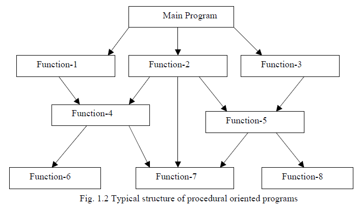

layout: true

<div class="my-header"></div>

<div class="my-footer"><span>
Kevin Rue-Albrecht
&emsp;&emsp;&emsp;&emsp;&emsp;&emsp;&emsp;&emsp;&emsp;
Object Oriented Programming in <i class="fab fa-r-project"></i>
</span></div>

```{r setup, include = FALSE}
stopifnot(requireNamespace("htmltools"))
htmltools::tagList(rmarkdown::html_dependency_font_awesome())
knitr::opts_chunk$set(
  message = FALSE, warning = FALSE, error = FALSE,
  include = FALSE
)
```

```{r, load_refs, include=FALSE, cache=FALSE}
options(htmltools.dir.version = FALSE)
library(RefManageR)
BibOptions(
  check.entries = FALSE,
  bib.style = "authoryear",
  cite.style = "authoryear",
  max.names = 2,
  style = "markdown",
  hyperlink = "to.doc",
  dashed = TRUE)
bib <- ReadBib("bibliography.bib")
```

---

# Lesson goals and objectives

## Learning goals

- Understand the concept of object-oriented programming.

- Describe how to access the contents of an S3 object.

- Identify methods that behave differently for objects of different classes.

- Develop good practices to name objects and functions in your <i class="fab fa-r-project"></i> workspace.

## Learning objectives

- Create objects of various classes.

- Inspect their contents.

- Apply methods to objects of various classes.

---

# Prerequisites

<br/>

.x-large-list[
- A clone of the shared GitHub repository for this course.

- A working installation of [R](https://www.r-project.org/) (4.0.3).

- A working installation of [git](https://git-scm.com/).

- A working installation of [RStudio](https://rstudio.com/).
]

---

# Set up

- Pull the `master` branch of the shared repository.

> We have added some files to get you started.

- In the daily sub-directory, make a copy of the `template` sub-directory with your HPC username.

> e.g. `cp -R template kevinrue`

The resulting file structure should look like the following:

```
  OBDS_Training_May_2021/
  |_ 3_r_genomics_data_science/
    |_ 1_oop/
      |_ template
        |_ ... (files)
      |_ kevinrue (copied from 'template')
        |_ ... (files)
        |_ oop.Rproj
```

- Launch the RStudio project `oop.Rproj` in your sub-directory.

---

# So far, in the course

## Procedural programming

- So far we have been using functions

- This is but one type of programming paradigm

.pull-left[
```{r, include=TRUE, echo=FALSE, fig.align='center'}
## Source: http://www.hexainclude.com/procedure-oriented-programming-language/

```
]

.pull-right[
- Divide and conquer

- Readable

- Sustainable

- Easier to debug

- Reuse code
]

---

# Object Oriented Programming (OOP)

.pull-left[
## Why Object Oriented Programming?

- Better code reusability
- Better security mechanisms
- More flexibility and scalability
]

.pull-right[
## In procedural programming:

- Decompose the problem into sub-problems
- Write _functions_ for each sub-problem
- Task oriented

## In object-oriented programming:

- Focus on _data_ rather than logic
- Use _objects_ / _classes_ to model real-world concepts
- Objects can communicate with each other
]

---

# Further reading

- TODO

---

# References

.small-text[
```{r, include=TRUE, echo=FALSE, results="asis"}
PrintBibliography(bib)
```
]
