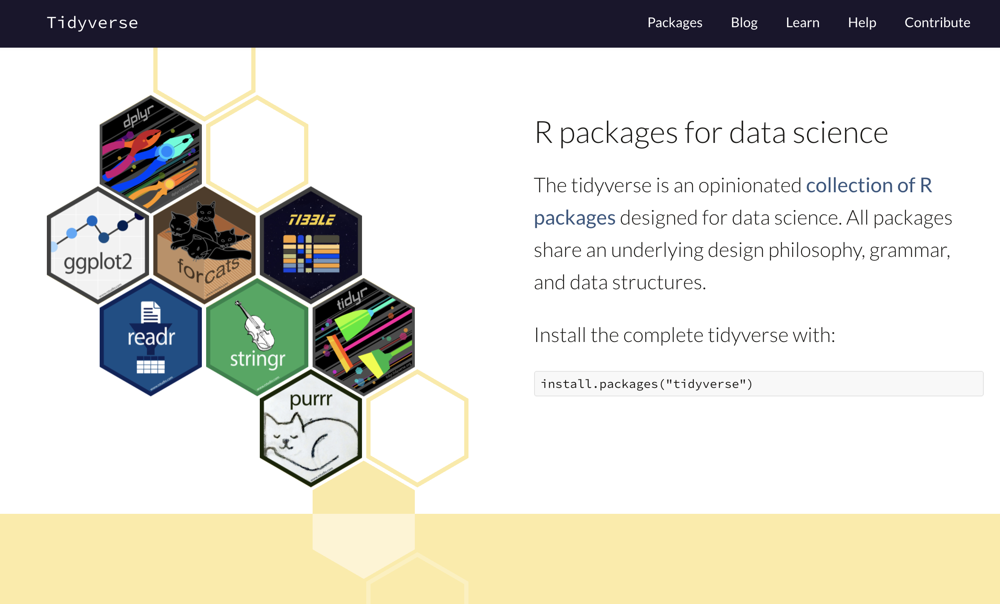

layout: true

<div class="my-header"></div>

<div class="my-footer"><span>
Kevin Rue-Albrecht
&emsp;&emsp;&emsp;&emsp;&emsp;&emsp;&emsp;&emsp;&emsp;
The <i class="fab fa-r-project"></i> tidyverse
</span></div>

```{r setup, include = FALSE}
stopifnot(requireNamespace("htmltools"))
htmltools::tagList(rmarkdown::html_dependency_font_awesome())
knitr::opts_chunk$set(
  message = FALSE, warning = FALSE, error = FALSE,
  include = FALSE
)
stopifnot(require(magrittr))
```

```{r, load_refs, include=FALSE, cache=FALSE}
options(htmltools.dir.version = FALSE)
library(RefManageR)
BibOptions(
  check.entries = FALSE,
  bib.style = "authoryear",
  cite.style = "authoryear",
  max.names = 2,
  style = "markdown",
  hyperlink = "to.doc",
  dashed = TRUE)
bib <- ReadBib("bibliography.bib")
```

---

# Lesson goals and objectives

## Learning goals

<!--
High-level "big picture" objectives of the learning process.
This should be no more than 3 bullet points.
-->

- Describe tidy data.
- Appreciate that scripts can combine base R and tidyverse.
- Assemble iteratively longer workflows using the tidyverse pipe.

## Learning objectives

<!--
More concrete and measurable outputs.
This can range from 3 to 8 bullet points.
-->

- Import and manipulate tidy data using packages from the tidyverse.
- Compute summary statistics on groups of observations in data frames.
- Filter data frames to select observations that meet certain criteria.
- Combine information from multiple data frames using matching information in certain columns.

---

# Prerequisites

<br/>

.x-large-list[
- A clone of the shared GitHub repository for this course.

- A working installation of [R](https://www.r-project.org/) (4.0.3).

- A working installation of [git](https://git-scm.com/).

- A working installation of [RStudio](https://rstudio.com/).
]

---

# Set up

- Pull the `master` branch of the shared repository.

> We have added some files to get you started.

- In the daily sub-directory, make a copy of the `template` sub-directory with your username.

> e.g. `cp -R template albrecht`

The resulting file structure should look like the following:

```
  OBDS_Training_Sep_2021/
  |_ 2_r/
    |_ 5_tidyverse/
      |_ template
        |_ ... (files)
      |_ kevinrue (copied from 'template')
        |_ ... (files)
        |_ tidyverse.Rproj
```

- Launch the RStudio project `tidyverse.Rproj` in your sub-directory.

---

# The tidyverse

```{r, include=TRUE, echo=FALSE, out.height='500px', fig.align='center'}
## Source: https://www.tidyverse.org/

```

---

# Packages of the tidyverse

.pull-left[
- `r BiocStyle::CRANpkg("ggplot2")`: plot data.

- `r BiocStyle::CRANpkg("dplyr")`: manipulate data.

- `r BiocStyle::CRANpkg("tidyr")`: tidy data.

- `r BiocStyle::CRANpkg("readr")`: import data from files.
]

.pull-right[
- `r BiocStyle::CRANpkg("purrr")`: apply vectorised functions.

- `r BiocStyle::CRANpkg("tibble")`: the tidyverse `data.frame`.

- `r BiocStyle::CRANpkg("stringr")`: work with character strings.

- `r BiocStyle::CRANpkg("forcats")`: work with factors.
]

---

# The data science workflow

```{r, include=TRUE, echo=FALSE, out.height='250px', fig.align='center'}
## Source: https://r4ds.had.co.nz/introduction.html
knitr::include_graphics("img/r4ds-data-science.png")
```

.center[
The tidyverse provides functions for each stage of the data science process.
]

---

# Tidy data

.pull-left[
## Tidy

```{r, include=TRUE, echo=FALSE}
x <- matrix(
  data = rbinom(50, 10, 0.5), nrow = 10, ncol = 5,
  dimnames = list(paste0("R", seq_len(10)), paste0("C", seq_len(5))))
x <- as.data.frame(x)
x
```
]

.pull-right[
## Not tidy
```{r, include=TRUE, echo=FALSE}
x %>% 
  tibble::rownames_to_column(var = "row") %>% 
  tidyr::pivot_longer(tidyselect::starts_with("C"), names_to = "column")
```
]

.center[
**How would you describe the difference between the tidy  and the "not tidy" layout of the data?**
]

---

# Loading tidyverse packages

Loading the `r BiocStyle::CRANpkg("tidyverse")` package loads all the packages of the tidyverse in a single command.

```{r, include=TRUE, message=TRUE}
library(tidyverse)
```

However, packages of the tidyverse can also be loaded individually, e.g.

```{r, include=TRUE}
library(ggplot2)
```

---

# Import and export data

<!-- Source: https://www.tidyverse.org/packages/ -->


> provides a fast and friendly way to read rectangular data (like csv, tsv, and fwf).
> It is designed to flexibly parse many types of data found in the wild, while still cleanly failing when data unexpectedly changes.

```{r}
library(readr)
```

The `r BiocStyle::CRANpkg("readr")` package is mostly known for its functions to read and write files, e.g.

.pull-left[
- `read_csv`

- `read_tsv`

- `read_delim`

- `read_rds`
]

.pull-right[
- `write_csv`

- `write_tsv`

- `write_delim`

- `write_rds`
]

---

# Exercise

## Read and write files

- Read data from the file `mtcars.csv` using `r BiocStyle::CRANpkg("readr")`.
  Assign the data imported from the file to an object called `mtcar_raw`.

.center[
**What do you learn about the data from the messages displayed in the R console while the contents of the file are parsed and imported into your R session?**
]

- Display the value of `mtcar_raw` in the R console.

.center[
**What is the class of the data? What are the dimensions of the dataset? What is the type of data stored in each column?**
]

- Write the first four columns of the dataset to a file named `mtcars.tsv`, separating fields with the TAB character.

.center[
**What function do you use? What options are available for that function?**
]

- Inspect the file.
  You can use `file.edit()` to open the file in the RStudio editor.

.center[
**Are you satisfied with the contents and appearance of the file?**
]

---

# Further reading

- [R for Data Science](https://r4ds.had.co.nz/)

- [RStudio Cheat Sheets](https://www.rstudio.com/resources/cheatsheets/)

---

# References

.small-text[
```{r, include=TRUE, echo=FALSE, results="asis"}
PrintBibliography(bib)
```
]
