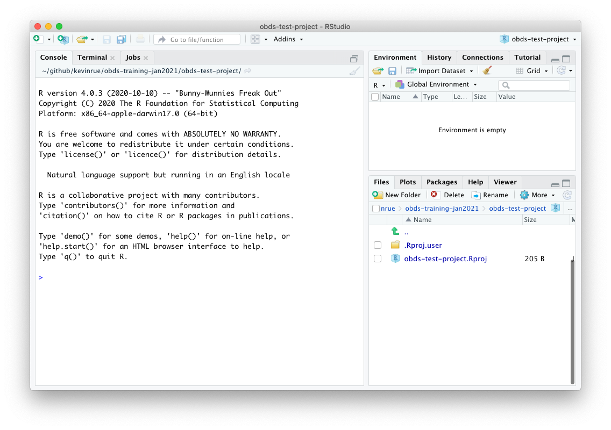
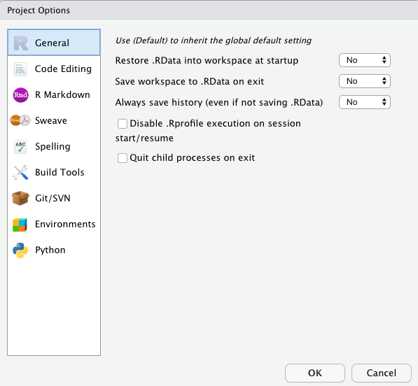
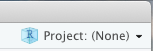

layout: true

<div class="my-header"></div>

<div class="my-footer"><span>
Kevin Rue-Albrecht
&emsp;&emsp;&emsp;&emsp;&emsp;&emsp;&emsp;&emsp;&emsp;
Statistics and Machine Learning in <i class="fab fa-r-project"></i>
</span></div>

```{r setup, include = FALSE}
stopifnot(requireNamespace("htmltools"))
htmltools::tagList(rmarkdown::html_dependency_font_awesome())
knitr::opts_chunk$set(
  message = FALSE, warning = FALSE, error = FALSE,
  include = FALSE
)
```

```{r, load_refs, include=FALSE, cache=FALSE}
options(htmltools.dir.version = FALSE)
library(RefManageR)
BibOptions(
  check.entries = FALSE,
  bib.style = "authoryear",
  cite.style = "authoryear",
  max.names = 2,
  style = "markdown",
  hyperlink = "to.doc",
  dashed = TRUE)
bib <- ReadBib("bibliography.bib")
```

---

# Set up

<br/>

.x-large-list[
- A clone of a personal GitHub repository for this course.

- A clone of a shared GitHub repository for this course.

- A working installation of R (4.0.3) including the `r BiocStyle::CRANpkg("renv")` package.

- A working installation of <i class="fab fa-git"></i>.

- A working installation of RStudio.
]

---

# Lesson goals and objectives

## Learning goals

.x-large-list[
- Understand the concept of projects in RStudio.

- Understand the concept of R environment.
]

## Learning objectives

.x-large-list[
- Create and switch between RStudio projects.

- Create, manage, and share R environment using `r BiocStyle::CRANpkg("renv")`.
]

---

# RStudio projects

From [support.rstudio.com](https://support.rstudio.com/hc/en-us/articles/200526207-Using-Projects):

> RStudio projects make it straightforward to divide your work into multiple contexts, each with their own working directory, workspace, history, and source documents.

RStudio projects are associated with R working directories. You can create an RStudio project:

- In a brand new directory

- In an existing directory where you already have R code and data

- By cloning a version control (e.g., [Git](https://git-scm.com/), [Subversion](https://subversion.apache.org/)) repository

It is up to you to decide how to manage projects:

- Projects may be independent pieces of work, or different pieces of a larger project.

- Projects are helpful to logically structure your work.

- Files outside of projects are easily lost and their origin can be difficult to track.

---

# Create a new project

To create a new project use the **Create Project** command (available on the **Projects** menu and on the global toolbar):

```{r, include=TRUE, echo=FALSE, fig.align='center'}
knitr::include_graphics("img/projects_new.png")
```

---

# Create a test project

- Select **New Directory**.

- Select **New Project**.

- In **Directory name:**, type `"obds-test-project"`.

- In **Create project as subdirectory of :**, click on **Browse** and select the directory of your personal GitHub repository for this course.

- Untick the following checkboxes, if there are present:

  + **Create a git repository** (we create this project within a repository already)
  
  + **Use renv with this project** (we will use `r BiocStyle::CRANpkg("renv")` later).

> **Note:** The latter may not be visible if `r BiocStyle::CRANpkg("renv")` is not installed.
  We will install it later.

---

# New project

```{r, include=TRUE, echo=FALSE, fig.align='center'}

```

---

# New project

When a new project is created, RStudio:

- Creates a **project file** (with an `.Rproj` extension) within the project directory.
  This file contains various project options, and can also be used as a shortcut for opening the project directly from the filesystem.

- Creates a hidden directory named `.Rproj.user` where project-specific temporary files (e.g. auto-saved source documents, window-state, etc.) are stored.
  This directory is also automatically added to `.Rbuildignore`, `.gitignore`, etc., if required.

- Loads the project into RStudio and display its name in the **Projects** toolbar (which is located on the far right side of the main toolbar)

---

# Working with projects

## Opening projects

There are several ways to open a project:

- Using the **Open Project** command (available from both the **Projects** menu and the **Projects** toolbar) to browse for and select an existing project file (e.g. `MyProject.Rproj`).

- Selecting a project from the list of most recently opened projects (also available from both the **Projects** menu and toolbar).

- Double-clicking on the project file within the system shell (e.g. Windows Explorer, OSX Finder, etc.).

---

# Working with projects

## Opening projects

When a project is opened within RStudio the following actions are taken:

- A new <i class="fab fa-r-project"></i> session (process) is started

- The `.Rprofile` file in the project's main directory (if any) is sourced by <i class="fab fa-r-project"></i>

- The `.RData` file in the project's main directory is loaded (if project options indicate that it should be loaded).

- The `.Rhistory` file in the project's main directory is loaded into the RStudio **History** pane (and used for Console Up/Down arrow command history).

- The current working directory is set to the project directory.

- Previously edited source documents are restored into editor tabs.

- Other RStudio settings (e.g. active tabs, splitter positions, etc.) are restored to where they were the last time the project was closed.

---

# Working with projects

## Quitting a project

When you are within a project and choose to either Quit, close the project, or open another project the following actions are taken:

- `.RData` and/or `.Rhistory` are written to the project directory (if current options indicate they should be).

- The list of open source documents is saved (so it can be restored next time the project is opened)

- Other RStudio settings (as described above) are saved.

- The <i class="fab fa-r-project"></i> session is terminated.

> **Note:** in a moment, we will disable `.RData` and `.Rhistory`.

---

# Working with projects

## Working with multiple projects at once

You can work with more than one RStudio project at a time by simply opening each project in its own instance of RStudio.
There are two ways to accomplish this:

1. Use the **Open Project** in **New Window** command located on the **Project** menu.

2. Opening multiple project files via the system shell (i.e. double-clicking on the project file).

---

# Working with projects

## Project options

There are several options that can be set on a per-project basis to customize the behavior of RStudio.
You can edit these options using the **Project Options** command on the **Project** menu:

```{r, include=TRUE, echo=FALSE, fig.align='center', out.height='400px'}

```

---

# Project options - General

Note that the **General** project options are all overrides of existing global options.
To inherit the default global behavior for a project you can specify `(Default)` as the option value.

- **Restore .RData into workspace at startup** — Load the `.RData` file (if any) found in the initial working directory into the R workspace (global environment) at startup.
  If you have a very large `.RData` file then unchecking this option will improve startup time considerably.
  
> Select **No**.

- **Save workspace to .RData on exit** — Ask whether to save `.RData` on exit, always save it, or never save it.
  Note that if the workspace is not dirty (no changes made) at the end of a session then no prompt to save occurs even if **Ask** is specified.
  
> Select **No**.

- **Always save history (even when not saving .RData)** — Make sure that the `.Rhistory` file is always saved with the commands from your session even if you choose not to save the .RData file when exiting.
  
> Select **No**.

---

# Project options - Code Editing

- **Index R source files** — Determines whether R source files within the project directory are indexed for code navigation (i.e. go to file/function, go to function definition).

> Normally this should remain enabled, however if you have a project directory with thousands of files and are concerned about the overhead of monitoring and indexing them you can disable indexing here.

- **Insert spaces for tab** — Determine whether the tab key inserts multiple spaces rather than a tab character (soft tabs).

> Tick the checkbox and configure 4 spaces per soft-tab.

- **Text encoding** — Specify the default text encoding for source files.
  Note that source files which don't match the default encoding can still be opened correctly using the **File : Reopen with Encoding** menu command.

> We recommend **UTF-8**, which should be the default value.

---

# Project options - Git/SVN

## Version control

- **Version control system** — Specify the version control system to use with this project.
Note that RStudio automatically detects the presence of version control for projects by scanning for a `.git` or `.svn` directory.
Therefore it isn't normally necessary to change this setting.
You may want to change the setting for the following reasons:

  1. You have both a `.git` and `.svn` directory within the project and wish to specify which version control system RStudio should bind to.
  2. You have no version control setup for the project and you want to add a local git repository (equivalent to executing git init from the project root directory).

---

# Install `renv`

In RStudio:

> **Note:** if you are currently in a project, close it. </img>

- Install `r BiocStyle::CRANpkg("renv")`

- Restart RStudio (to make sure that the changes take effect).

---

# Learning objectives

<br/>

.xx-large-list[
- TODO
]

---


---

# Further reading

- [support.rstudio.com - "Using Projects"](https://support.rstudio.com/hc/en-us/articles/200526207-Using-Projects)

---

# References

.small-text[
```{r, include=TRUE, echo=FALSE, results="asis"}
if (length(bib) > 0) {
  PrintBibliography(bib)
} else {
  cat("<p align='center'>n/a</p>")
}
```
]
