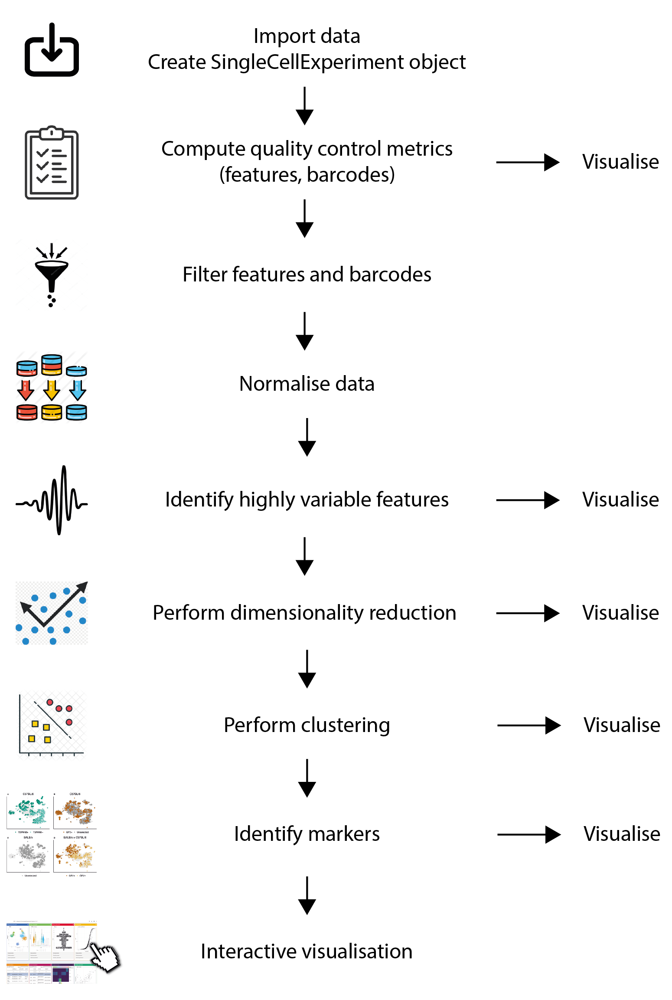

# Bioconductor resources and help

```{r, include=TRUE, echo=FALSE, out.height="100px", out.width="350px", fig.align="center"}
knitr::include_graphics("https://www.bioconductor.org/images/logo/jpg/bioconductor_logo_cmyk.jpg")
```

- Main website: <https://www.bioconductor.org/>

- Support site: <https://support.bioconductor.org/>

- Courses & Conferences materials: <https://www.bioconductor.org/help/course-materials/>

- YouTube videos: <https://www.youtube.com/user/bioconductor>

- Slack workspace: <https://bioc-community.herokuapp.com/>

- Book: [Orchestrating Single-Cell Analysis with Bioconductor](https://bioconductor.org/books/release/OSCA/)

---

# The Bioconductor SummarizedExperiment

```{r, include=TRUE, echo=FALSE, out.height="450px", fig.align='center'}
knitr::include_graphics("https://media.springernature.com/lw685/springer-static/image/art%3A10.1038%2Fnmeth.3252/MediaObjects/41592_2015_Article_BFnmeth3252_Fig2_HTML.jpg?as=webp")
```

.footnote[
**Source:** https://www.nature.com/articles/nmeth.3252 (Figure 2)
]

---

# SingleCellExperiment extends SummarizedExperiment

.pull-left[
## SummarizedExperiment.

```{r, include=TRUE, echo=FALSE, fig.align='center'}
knitr::include_graphics("https://media.springernature.com/lw685/springer-static/image/art%3A10.1038%2Fnmeth.3252/MediaObjects/41592_2015_Article_BFnmeth3252_Fig2_HTML.jpg?as=webp")
```

.small-text[
**Source:** https://www.nature.com/articles/nmeth.3252 (Figure 2)
]
]

.pull-right[
## SingleCellExperiment

```{r, include=TRUE, echo=FALSE, fig.align='center'}
knitr::include_graphics("https://raw.githubusercontent.com/Bioconductor/OSCABase/images/images/SingleCellExperiment.png")
```

.small-text[
**Source:** https://osca.bioconductor.org/data-infrastructure.html
]
]

---

# SingleCellExperiment

```{r, include=TRUE, echo=FALSE, fig.align='center'}
knitr::include_graphics("https://raw.githubusercontent.com/Bioconductor/OSCABase/images/images/SingleCellExperiment.png")
```

.footnote[
**Source:** https://osca.bioconductor.org/data-infrastructure.html
]

---

# A single-cell analysis workflow using Bioconductor

.pull-left[
```{r, include=TRUE, echo=FALSE, fig.align='center', out.height='500px'}
knitr::include_graphics("https://raw.githubusercontent.com/Bioconductor/OSCABase/images/images/Workflow.png")
```
]

.pull-right[
**Source:** https://osca.bioconductor.org/overview.html#data-processing-and-downstream-analysis

<br/>

**Key points:**

- A shared data structure allows modular analysis.
- Individual packages provide
  + Data structures (`r BiocStyle::Biocpkg("SingleCellExperiment")`)
  + Method (`r BiocStyle::Biocpkg("scran")`, `r BiocStyle::Biocpkg("scater")`)
  + Annotation (`r BiocStyle::Biocpkg("org.Hs.eg.db")`)
  + Reporting (`r BiocStyle::CRANpkg("rmarkdown")`, `r BiocStyle::CRANpkg("shiny")`)
]

---

# Bioconductor and Seurat

.pull-left[
## Bioconductor (2001-)

<br/>


.small-text[
**Source:** https://osca.bioconductor.org/data-infrastructure.html
]
]

.pull-right[
## Seurat (2014-)

<br/>

.xx-small-table[
|Slot         |Function                                                                        |
|:------------|:-------------------------------------------------------------------------------|
|assays       |A list of assays within this object                                             |
|meta.data    |Cell-level meta data                                                            |
|active.assay |Name of active, or default, assay                                               |
|active.ident |Identity classes for the current object                                         |
|graphs       |A list of nearest neighbor graphs                                               |
|reductions   |A list of DimReduc objects                                                      |
|project.name |User-defined project name (optional)                                            |
|tools        |Empty list. Tool developers can store any internal data from their methods here |
|misc         |Empty slot. User can store additional information here                          |
|version      |Seurat version used when creating the object                                    |
]

.small-text[
**Source:** https://github.com/satijalab/seurat/wiki/Seurat
]
]

---

# Bioconductor and Scanpy

.pull-left[
## Bioconductor (2001-)

<br/>

```{r, include=TRUE, echo=FALSE, fig.align='center'}
knitr::include_graphics("https://media.springernature.com/lw685/springer-static/image/art%3A10.1038%2Fnmeth.3252/MediaObjects/41592_2015_Article_BFnmeth3252_Fig2_HTML.jpg?as=webp")
```

.small-text[
**Source:** https://www.nature.com/articles/nmeth.3252 (Figure 2)
]
]

.pull-right[
## Scanpy (2017-)

<br/>


.small-text[
**Source:** [https://anndata.readthedocs.io](https://anndata.readthedocs.io/en/latest/anndata.AnnData.html)
]
]

---

# Bioconductor single-cell workflow - Overview

```{r, include=TRUE, echo=FALSE, fig.align='center', out.height='540px', out.width='400px'}
## Source: Kevin Rue-Albrecht (Illustrator)

```

---

# Import single-cell data using Bioconductor

The package `r BiocStyle::Biocpkg("DropletUtils")` provides several utilities for reading and preprocessing single-cell data.

## Import

- `DropletUtils::read10xCounts()` imports 10X Genomics data from the CellRanger output directories.
  It returns a `SingleCellExperiment` object.

## Utilities and quality control

- `DropletUtils::barcodeRanks()` ccomputes barcode rank statistics and identify the knee and inflection points on the total count curve.
- `DropletUtils::emptyDrops()` is designed to distinguish between empty droplets and cells by testing each barcode’s expression profile for significant deviation from the ambient profile.
- `DropletUtils::swappedDrops()` removes the effects of barcode swapping.
  It takes a list of paths to individual samples and returns a list with an item called `cleaned`, itself a list of sparse matrices, after removing swapped molecules.
