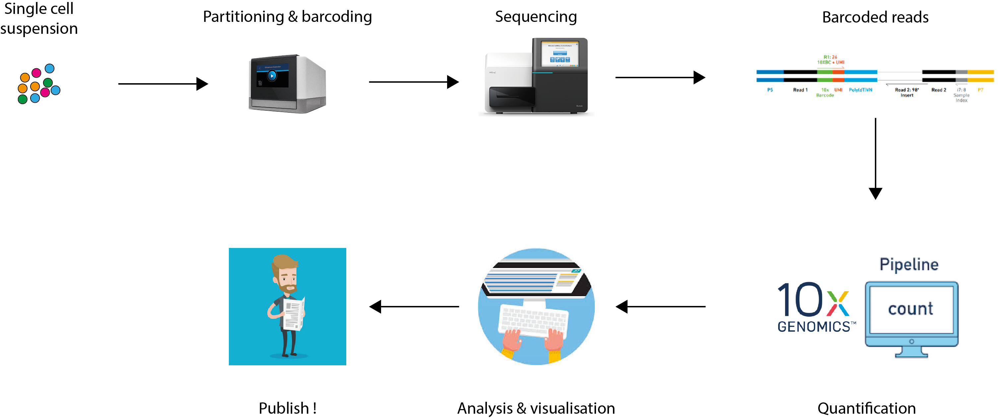

# Overview

```{r, include=TRUE, echo=FALSE}

```

---

# Exercise

## Import scRNA-seq data and create a Seurat object

- Load the `r BiocStyle::CRANpkg("Seurat")` package.

- Use the function `Read10X()` to import data in the `filtered_feature_bc_matrix/` directory in an object named `read10x_data`.
  What class of object does the function return?

- Have a look at the object and its structure.
  What is a sparse matrix and how does it store data?

- Create a Seurat object from the output of the `Read10X()` function.

- Create a Seurat object from the object `read10x_data`.
  Include features detected in at least 3 cells,
  and cells where at least 200 features detected.
  Name the project `pbmc5k`.
  How many features and cells are left in the Seurat object?

---

# Further reading

- TODO

---

# References

.small-text[
```{r, include=TRUE, echo=FALSE, results="asis"}
PrintBibliography(bib)
```
]
