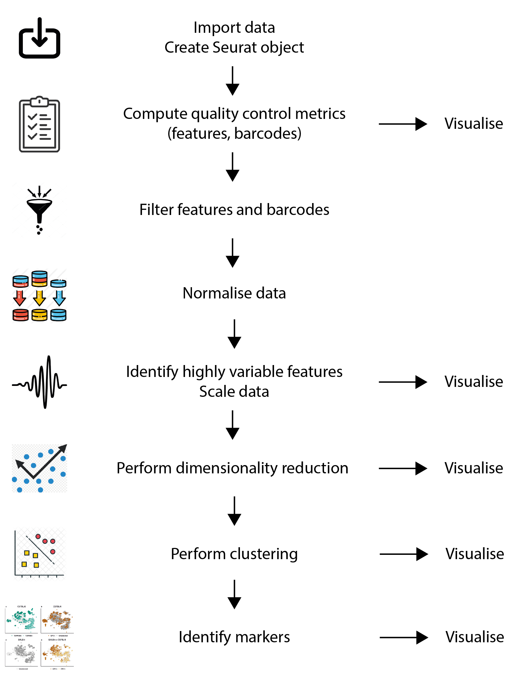

# Overview

```{r, include=TRUE, echo=FALSE}
## Source: Kevin Rue-Albrecht (Illustrator)
knitr::include_graphics("img/overview-workflow.png")
```

---

# Partitioning and barcoding

.pull-left[
```{r, include=TRUE, echo=FALSE, fig.align='center', out.height='200px'}
## Source: https://www.10xgenomics.com/instruments/chromium-controller
knitr::include_graphics("img/overview-graphic-chromium-svg.svg")
```
]

.pull-right[
## GEM Generation & Barcoding

- GEM: Gel bead-in EMulsions

- Partition single cells, nuclei, or gDNA.

- Objective: one GEM = one cell.
]

--

.pull-left[
```{r, include=TRUE, echo=FALSE, fig.align='center', out.height='200px'}
## Source: https://www.10xgenomics.com/products/single-cell-gene-expression
knitr::include_graphics("img/barcoding.jpeg")
```
]

.pull-right[
## GEM Generation & Barcoding

Gel beads coated with oligonucleotide barcodes.

  + TruSeq primer (fixed)

  + UMI barcode (unique, per bead)

  + 10x barcode (fixed, per bead)

  + A Poly(dT) tail (fixed)
]

---

# Empty droplets and doublets

Cells are loaded in a limiting dilution on the 10x Chromium controller, so that:

- Most GEMs do not contain any cell.

- Most of the GEMs that do contain a cell, contain a single cell.

- The rate of GEMs that contain doublets (or more) is as small as technically possible.

```{r, include=TRUE, echo=FALSE, fig.align='center', out.height='300px'}
## Source: https://www.technologynetworks.com/genomics/product-news/10x-genomics-extends-their-application-portfolio-305346
knitr::include_graphics("img/10x-genomics-extends-their-application-portfolio-305346-640x360.jpeg")
```

---

# Quantification

## Cell Ranger (10x Genomics)

```{r, include=TRUE, echo=FALSE, fig.align='center', out.height='200px'}
## Source: https://support.10xgenomics.com/single-cell-gene-expression/software/pipelines/latest/using/count

```

- Most of the time, you will start from FASTQ files.

- [cellranger count](https://support.10xgenomics.com/single-cell-gene-expression/software/pipelines/latest/using/count)
  is the method officially supported by 10x Genomics.

- Other methods include
  [salmon alevin](https://salmon.readthedocs.io/en/latest/alevin.html) and
  [kallisto | bustools](https://www.kallistobus.tools/).

In all cases, the objective of quantification is to produce a matrix of UMI counts,
for each feature and each barcode (i.e., cell).

That matrix is the starting point of your analysis using `r BiocStyle::CRANpkg("Seurat")`.

---

# cellranger count - outputs

```{r, include=TRUE, echo=FALSE, fig.align='center'}
## Source: https://support.10xgenomics.com/single-cell-gene-expression/software/pipelines/latest/output/overview
knitr::include_graphics("img/cellranger_count_output.png")
```

---

# Seurat workflow - Overview

```{r, include=TRUE, echo=FALSE, fig.align='center', out.height='500px', out.width='400px'}
## Source: Kevin Rue-Albrecht (Illustrator)

```

---

# Seurat workflow - Create a Seurat object

```{r, include=TRUE, echo=FALSE, fig.align='center', out.height='500px', out.width='400px'}
## Source: Kevin Rue-Albrecht (Illustrator)
knitr::include_graphics("img/overview-analysis-import.png")
```

---

# Exercise

## Import scRNA-seq data and create a Seurat object

- Load the `r BiocStyle::CRANpkg("Seurat")` package.

- Use the function `Read10X()` to import data in the `filtered_feature_bc_matrix/` directory in an object named `read10x_data`.
  What class of object does the function return?

- Have a look at the object and its structure.
  What is a sparse matrix and how does it store data?

- How many features and barcodes (i.e., cells) are present in the data set?

- Create a Seurat object from the object `read10x_data`.
  Name the object `seurat_object`.
  Include features detected in at least 3 cells,
  and cells where at least 200 features detected.
  Name the project `pbmc5k`.
  How many features and barcodes are left in the Seurat object?

- How many features and cells were filtered out when you created the Seurat object?

---

# Contents of a Seurat object

```{r, include=TRUE, echo=FALSE, fig.align='center'}
## Source: https://github.com/satijalab/seurat/wiki/Seurat#slots
knitr::include_graphics("img/seurat-slots.png")
```

<https://github.com/satijalab/seurat/wiki/Seurat#slots>

---

# Assay objects

```{r, include=TRUE, echo=FALSE, fig.align='center'}
## Source: https://github.com/satijalab/seurat/wiki/Assay#slots

```

<https://github.com/satijalab/seurat/wiki/Assay#slots>

---

# Accessing the contents of a Seurat object

Functions designed to access and interact the contents of a Seurat object were moved to a separate package
called `r BiocStyle::CRANpkg("SeuratObject")`.

- `DefaultAssay()` returns the name of the "active" assay, used by default if unspecified.

- `Assays()` returns the names of the available assays.

- `[[` is a versatile function used to fetch one assay object or one column of cell metadata as a `data.frame`.
  Get all the metadata using empty brackets, i.e. `seurat_object[[]]`.

- `FetchData()` is a generalised version of `[[` that returns per-cell information (e.g., feature expression, dimensionality reduction coordinates, metadata).

> You will need to know the names of the variables available in the various components of your own Seurat object.

- `$` is used to access one column of cell metadata as a `vector`.

- `GetAssayData()` returns the (sparse) matrix for a given assay.

... but a lot of the slots do not have dedicated functions.
Instead they are access using `@`, e.g. `seurat_object@project.name`.

---

# Exercise

## Accessing the contents of a Seurat object

- Query the name of the default assay in the Seurat object.

- List the names of assays available in the Seurat object.

- Display the first six rows of the RNA assay data.
  What function do you use?
  Which arguments do you need to supply, and which ones are optional?

- Display the entire data.frame of per-cell metadata (at least the first six rows).
  What column names do you see?

- Fetch one column of metadata using `[[`.
  What type of object do you get back?

- Instead, fetch the same column of metadata using `$`.
  What type of object do you get back this time?

---

# Further reading

- TODO

---

# Advanced

## Feature barcoding

.pull-left[
```{r, include=TRUE, echo=FALSE, fig.align='center', out.height='200px'}
## Source: http://en.biomarker.com.cn/platforms/10x-genomics

```
]

.pull-right[
- Poly(dT)VN captures RNA molecules.

- Additional capture sequences for other targets.

- Targets must be barcoded with a complementary oligonucleotide.
]

---

# References

.small-text[
```{r, include=TRUE, echo=FALSE, results="asis"}
PrintBibliography(bib)
```
]
