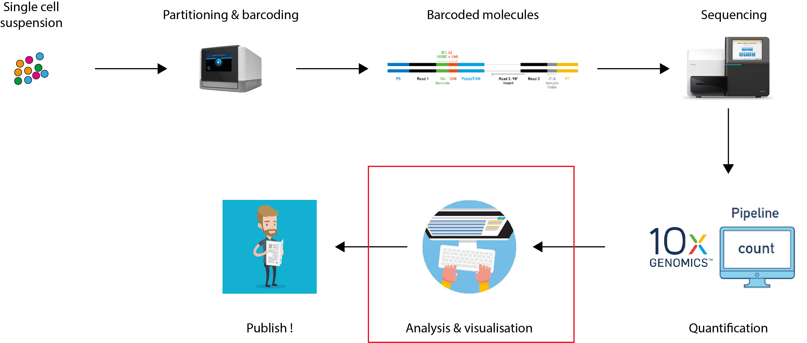
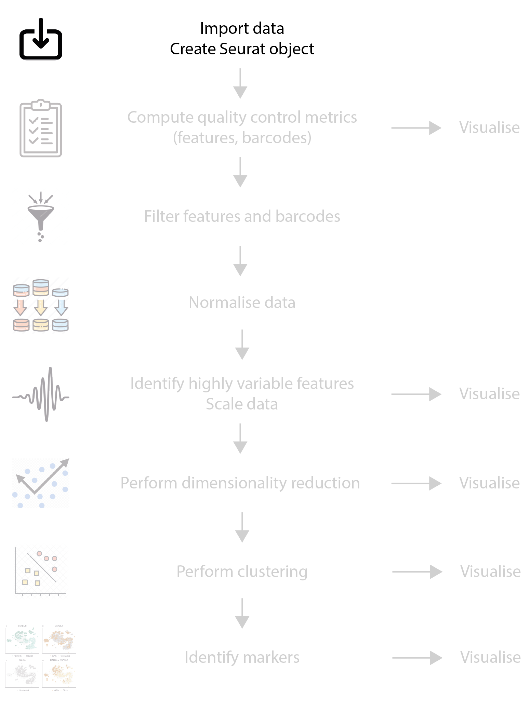
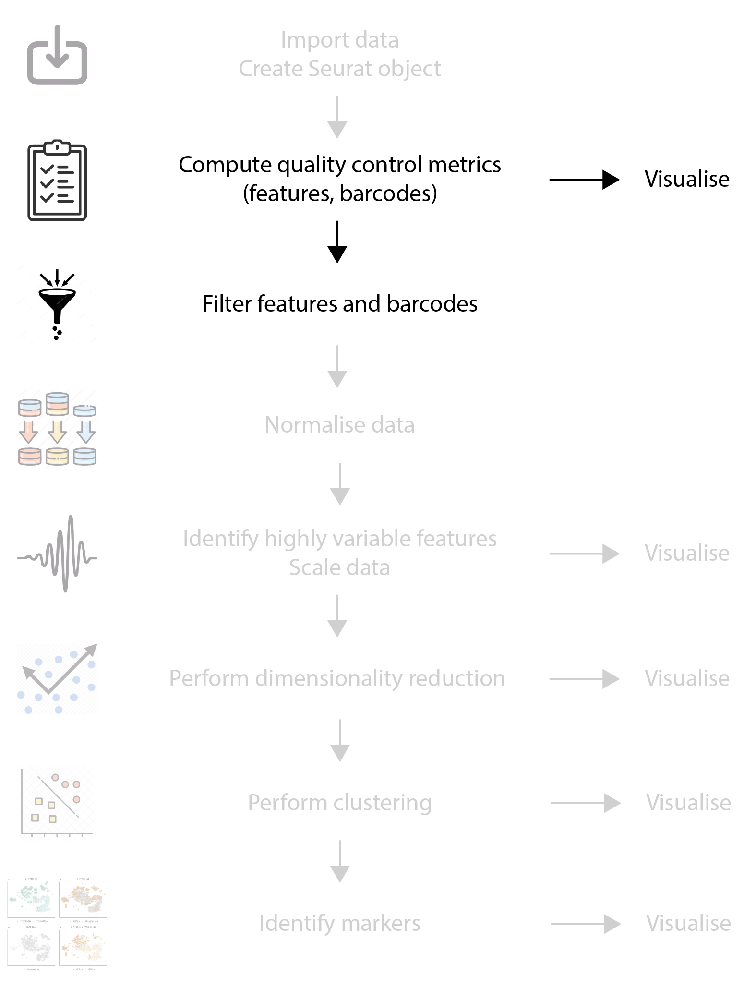
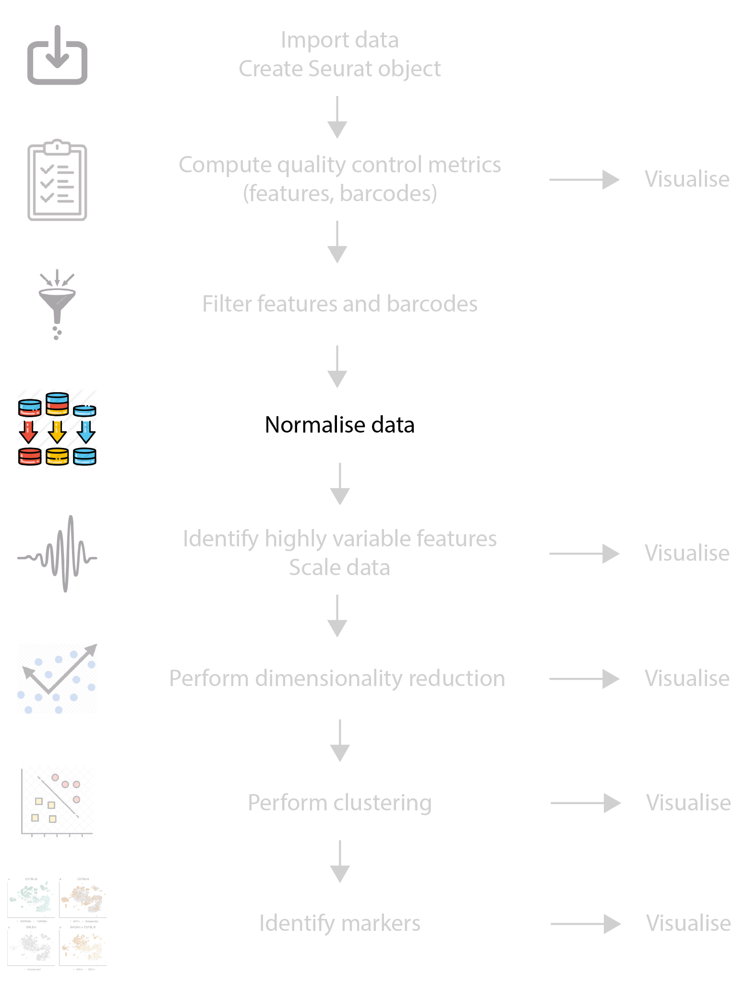

# Setup

- Checkout and pull the main branch of the shared repository.

- Create a new branch in the Git repository. Use your username and the date to make it unique.
- Make a copy of the file `template.Rmd` for this lesson. Use your username to make it unique.

> e.g. `cp template.Rmd template_kevinrue.Rmd`

- Open your copy of the notebook in RStudio.

- Download and uncompress the "Feature / cell matrix (filtered)" file for the 10x Genomics example data set [5k Peripheral blood mononuclear cells (PBMCs) from a healthy donor (Next GEM)](https://www.10xgenomics.com/resources/datasets/5-k-peripheral-blood-mononuclear-cells-pbm-cs-from-a-healthy-donor-next-gem-3-1-standard-3-0-2).

- Follow along, running and writing code from the notebook as mentioned during the lesson.

---

# Overview

```{r, include=TRUE, echo=FALSE}
## Source: Kevin Rue-Albrecht (Illustrator)

```

---

# Partitioning and barcoding

.pull-left[
```{r, include=TRUE, echo=FALSE, fig.align='center', out.height='200px'}
## Source: https://www.10xgenomics.com/instruments/chromium-controller

```
]

.pull-right[
## GEM Generation & Barcoding

- GEM: Gel bead-in EMulsions

- Partition single cells, nuclei, or gDNA.

- Objective: one GEM = one cell.
]

--

.pull-left[
```{r, include=TRUE, echo=FALSE, fig.align='center', out.height='200px'}
## Source: https://www.10xgenomics.com/products/single-cell-gene-expression
knitr::include_graphics("img/barcoding.jpeg")
```
]

.pull-right[
## GEM Generation & Barcoding

Gel beads coated with oligonucleotide barcodes.

  + TruSeq primer (fixed)

  + UMI barcode (unique, per bead)

  + 10x barcode (fixed, per bead)

  + A Poly(dT) tail (fixed)
]

---

# Empty droplets and doublets

Cells are loaded in a limiting dilution on the 10x Chromium controller, so that:

- Most GEMs do not contain any cell.

- Most of the GEMs that do contain a cell, contain a single cell.

- The rate of GEMs that contain doublets (or more) is as small as technically possible.

```{r, include=TRUE, echo=FALSE, fig.align='center', out.height='300px'}
## Source: https://www.technologynetworks.com/genomics/product-news/10x-genomics-extends-their-application-portfolio-305346

```

---

# Quantification

## Cell Ranger (10x Genomics)

```{r, include=TRUE, echo=FALSE, fig.align='center', out.height='200px'}
## Source: https://support.10xgenomics.com/single-cell-gene-expression/software/pipelines/latest/using/count
knitr::include_graphics("img/cellranger_count.png")
```

- Most of the time, you will start from FASTQ files.

- [cellranger count](https://support.10xgenomics.com/single-cell-gene-expression/software/pipelines/latest/using/count)
  is the method officially supported by 10x Genomics.

- Other methods include
  [salmon alevin](https://salmon.readthedocs.io/en/latest/alevin.html) and
  [kallisto | bustools](https://www.kallistobus.tools/).

In all cases, the objective of quantification is to produce a matrix of UMI counts,
for each feature and each barcode (i.e., cell).

That matrix is the starting point of your analysis using `r BiocStyle::CRANpkg("Seurat")`.

---

# cellranger count - outputs

```{r, include=TRUE, echo=FALSE, fig.align='center'}
## Source: https://support.10xgenomics.com/single-cell-gene-expression/software/pipelines/latest/output/overview

```

---

# Seurat workflow - Overview

```{r, include=TRUE, echo=FALSE, fig.align='center', out.height='500px', out.width='400px'}
## Source: Kevin Rue-Albrecht (Illustrator)
knitr::include_graphics("img/overview-analysis.png")
```

---

# Seurat workflow - Create a Seurat object

```{r, include=TRUE, echo=FALSE, fig.align='center', out.height='500px', out.width='400px'}
## Source: Kevin Rue-Albrecht (Illustrator)

```

---

# Exercise

## Import scRNA-seq data and create a Seurat object

- Load the `r BiocStyle::CRANpkg("Seurat")` package.

- Use the function `Read10X()` to import data in the `filtered_feature_bc_matrix/` directory in an object named `read10x_data`.
  What class of object does the function return?

- Have a look at the object and its structure (first six rows and columns).
  What is a sparse matrix and how does it store data?

- How many features and barcodes (i.e., cells) are present in the data set?

- Create a Seurat object using the function `CreateSeuratObject()`
  and the object `read10x_data`.
  Name the object `seurat_object`.
  Include features detected in at least 3 cells,
  and cells where at least 200 features detected.
  Name the project `pbmc5k`.
  How many features and barcodes are left in the Seurat object?

- How many features and cells were filtered out when you created the Seurat object?

---

# Contents of a Seurat object

```{r, include=TRUE, echo=FALSE, fig.align='center'}
## Source: https://github.com/satijalab/seurat/wiki/Seurat#slots

```

<https://github.com/satijalab/seurat/wiki/Seurat#slots>

---

# Assay objects

```{r, include=TRUE, echo=FALSE, fig.align='center'}
## Source: https://github.com/satijalab/seurat/wiki/Assay#slots
knitr::include_graphics("img/seurat-assay-slots.png")
```

<https://github.com/satijalab/seurat/wiki/Assay#slots>

---

# Accessing the contents of a Seurat object

Functions designed to access and interact the contents of a Seurat object were moved to a separate package
called `r BiocStyle::CRANpkg("SeuratObject")`.

- `DefaultAssay()` returns the name of the "active" assay, used by default if unspecified.

- `Assays()` returns the names of the available assays.

- `[[` is a versatile function used to fetch one assay object or one column of cell metadata as a `data.frame`.
  Get all the metadata using empty brackets, i.e. `seurat_object[[]]`.

- `FetchData()` is a generalised version of `[[` that returns per-cell information (e.g., feature expression, dimensionality reduction coordinates, metadata).

> You will need to know the names of the variables available in the various components of your own Seurat object.

- `$` is used to access one column of cell metadata as a `vector`.

- `GetAssayData()` returns the (sparse) matrix for a given assay.

... but a lot of the slots do not have dedicated functions.
Instead they are access using `@`, e.g. `seurat_object@project.name`.

---

# Cell identities

Seurat refers to cell identities as an umbrella for a number of things,
from experimental conditions to cluster labels.

- Sorted cells already have some form of identity.
  
- Clustering at different resolutions produce different set of labels.

Seurat stores the "active" identity of cells in a dedicated slot of the object.

- `Idents()` returns the "active" identity of the cells.

- `Idents(seurat_object) <- "name"` assigns the metadata column called `"name"` as the active identity.

- `SetIdent(object, cells = NULL, value)` can be used to assign a new identity to certain cells.

See `help("Idents", package = "SeuratObject")`.

---

# Exercise

## Accessing the contents of a Seurat object

- Query the name of the default assay in the Seurat object.

- List the names of assays available in the Seurat object.

- Display the first six rows and six columns of the RNA assay data.
  What function do you use?
  Which arguments do you need to supply, and which ones are optional?

- Display the entire data.frame of per-cell metadata (first six rows).
  What column names do you see?

- Fetch one column of metadata using `[[`.
  What type of object do you get back?

- Instead, fetch the same column of metadata using `$`.
  What type of object do you get back this time?

- Use the function `FetchData()` to access the library size and expression of the feature named `"LYZ"` (first six rows).
  What type of object do you get back?

---

# Common operations on Seurat objects

- `WhichCells()` returns the names of cells that match a logical expression.

> e.g. `WhichCells(seurat_object, expression = LYZ > 500)`

- `VariableFeatures()` returns the names of variable features (for a given assay, if computed).

- `subset()` returns a new Seurat object restricted to certain features and cells.

Those functions are often combined together, to achieve the desired result.
For instance:

```{r, include=TRUE, eval=FALSE}
subset(
    x = seurat_object,
    cells = WhichCells(seurat_object, expression = LYZ > 500),
    features = VariableFeatures(object = seurat_object)
)
```

- `merge()` combines the information from two Seurat objects into one.

... and more miscellaneous functions such as `colMeans()`, `colSums()`, `rowMeans()` and `rowSums()`.
See `help("Seurat-methods")`.

---

# Seurat workflow - Quality control

```{r, include=TRUE, echo=FALSE, fig.align='center', out.height='500px', out.width='400px'}
## Source: Kevin Rue-Albrecht (Illustrator)

```

---

# Quality control

.pull-left[
## Library size

```{r, include=TRUE, echo=FALSE}
ggplot(seurat_object[[]], aes(nCount_RNA)) +
    geom_histogram(color = "black", fill = "grey", bins = 100) +
    cowplot::theme_cowplot()
```
]

.pull-right[
## Number of features detected

```{r, include=TRUE, echo=FALSE}
ggplot(seurat_object[[]], aes(nFeature_RNA)) +
    geom_histogram(color = "black", fill = "grey", bins = 100) +
    cowplot::theme_cowplot()
```
]

---

# Computing metrics for quality control

- `PercentageFeatureSet()` computes the fraction of reads assigned to a subset of genes, for each cell.

  + The function takes either a vector of feature names or a regex pattern to match feature names against.

```{r, include=TRUE, eval=FALSE}
PercentageFeatureSet(seurat_object, pattern = "^CCL|^CXCL")
```

- `VlnPlot()` produces a violin plot for a selection of per-cell features, including gene expression, quality control metrics, and dimensionality reduction results available in a Seurat object.

- `FeatureScatter()` produces a scatter plot of two per-cell features,
  e.g., two features, a feature and quality control metric.

---

# Seurat visualisations

.pull-left[
## VlnPlot()

```{r, include=TRUE, echo=FALSE}
VlnPlot(seurat_object, features = c("nCount_RNA", "nFeature_RNA"))
```
]

.pull-right[
## FeatureScatter()

```{r, include=TRUE, echo=FALSE}
FeatureScatter(seurat_object, feature1 = "nCount_RNA", feature2 = "LYZ")
```
]

... but you will likely use `r BiocStyle::CRANpkg("ggplot2")` to make publication quality plots.

---

# Exercise

## Quality control and visualisation

- The library size and number of features detected per cell is already present in the Seurat object.
  Use the function `VlnPlot()` to display them in a single violin plot.

- Use the function `PercentageFeatureSet()` to compute the fraction of reads assigned to mitochondrial genes in each cell.
  Store the metric in the cell metadata of the Seurat object, under the name `"percent_mt"`.
  Visualise this new metric alongside the previous two in a new violin plot.

- Visualise a scatter plot of the proportion of mitochondrial UMIs against the library size in each cell.

- Create a new Seurat object, called `seurat_after_qc`, that is subsetted to cells that have more than 4,500 UMI counts, less than 15% of UMI counts assigned to mitochondrial features, and more than 1,500 features detected.
  How many cells were removed in this step?

---

# Seurat workflow - Normalisation

```{r, include=TRUE, echo=FALSE, fig.align='center', out.height='500px', out.width='400px'}
## Source: Kevin Rue-Albrecht (Illustrator)

```

---

# Normalisation strategies

- `NormalizeData()` provides a choice of standard normalisation strategies:

  + `"LogNormalize"`, based on the library size for each cell.
  
  + `"CLR"`, assumes an overall fixed abundance in all cells.
  
  + `"RC"` (relative counts), `"LogNormalize"` without the "Log".

---

# Exercise

## Normalisation and scaling

- Normalise the Seurat object (after quality control) using the `"LogNormalize"` method.

---

# Further reading

- TODO

---

# Advanced

## Feature barcoding

.pull-left[
```{r, include=TRUE, echo=FALSE, fig.align='center', out.height='200px'}
## Source: http://en.biomarker.com.cn/platforms/10x-genomics
knitr::include_graphics("img/feature-barcoding.png")
```
]

.pull-right[
- Poly(dT)VN captures RNA molecules.

- Additional capture sequences for other targets.

- Targets must be barcoded with a complementary oligonucleotide.
]

---

# References

.small-text[
```{r, include=TRUE, echo=FALSE, results="asis"}
PrintBibliography(bib)
```
]
