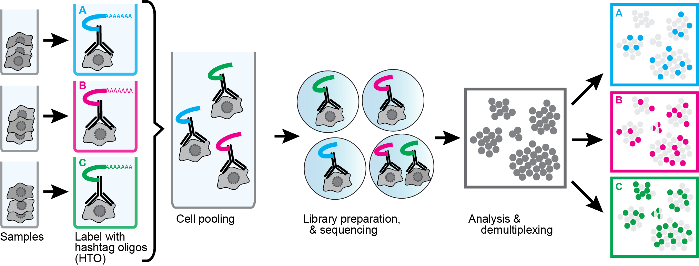

layout: true

<div class="my-header"></div>

<div class="my-footer"><span>
Kevin Rue-Albrecht
&emsp;&emsp;&emsp;&emsp;&emsp;&emsp;&emsp;&emsp;&emsp;&emsp;&emsp;&emsp;
Introduction to Seurat
</span></div> 

```{r setup, include = FALSE}
stopifnot(requireNamespace("htmltools"))
htmltools::tagList(rmarkdown::html_dependency_font_awesome())
knitr::opts_chunk$set(
  message = FALSE, warning = FALSE, error = FALSE,
  include = FALSE,
  fig.align="center"
)
options(width = 90)
library(tidyverse)
library(S4Vectors)
```

---

# Cell hashing

```{r, include=TRUE, echo=FALSE, out.height="250px", out.width="600px"}
## Source: https://cite-seq.com/cell-hashing/

```

.pull-left[
## Experimental

- Tag samples with distinct HTO.

- Pool ("multiplex") samples.

- Sequence HTO and GEX (gene expression).
]

.pull-right[
## Computational

- Quantify HTO and GEX.

- De-multiplex samples in each pool.

- Analyse GEX of cells identified.
]

.center[
**Basically the same principle as CITE-seq.**
]