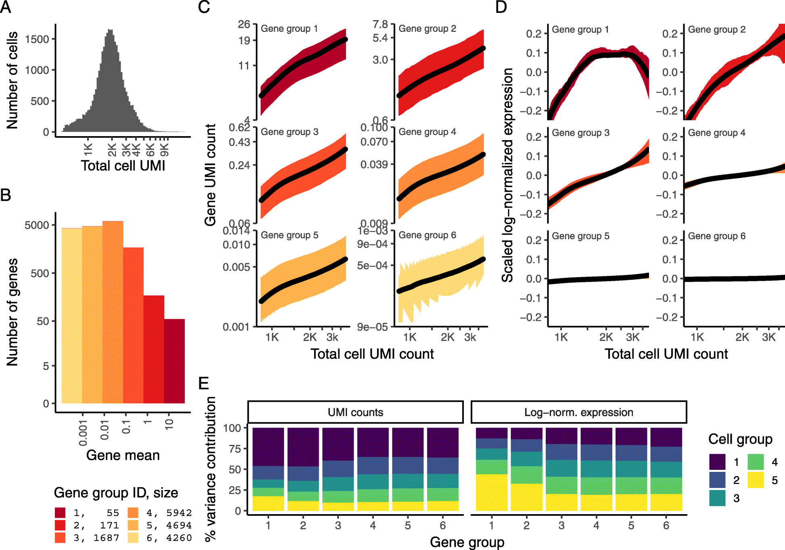

layout: true

<div class="my-header"></div>

<div class="my-footer"><span>
Kevin Rue-Albrecht
&emsp;&emsp;&emsp;&emsp;&emsp;&emsp;&emsp;&emsp;&emsp;&emsp;&emsp;&emsp;
Introduction to Seurat
</span></div> 

```{r setup, include = FALSE}
stopifnot(requireNamespace("htmltools"))
htmltools::tagList(rmarkdown::html_dependency_font_awesome())
knitr::opts_chunk$set(
  message = FALSE, warning = FALSE, error = FALSE,
  include = FALSE,
  fig.align="center"
)
options(width = 90)
library(tidyverse)
library(S4Vectors)
```

---

# SCTransform

```{r, include=TRUE, echo=FALSE, out.height="400px", out.width="600px"}
## Source: https://genomebiology.biomedcentral.com/articles/10.1186/s13059-019-1874-1

```

- Traditional log-normalisation only normalises low/medium-abundance genes effectively.

  + Groups 1-3 still display a relationship between sequencing depth and gene expression
    after log-normalisation.