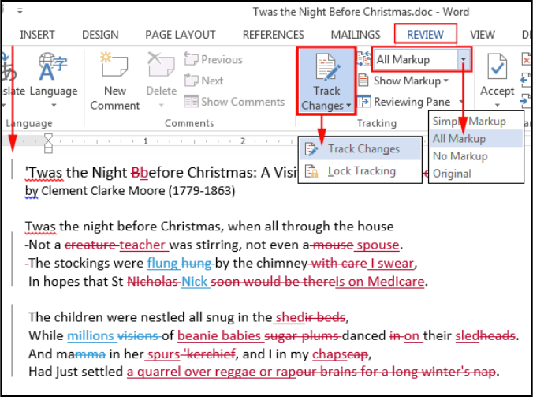
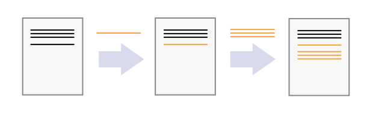

layout: true

<div class="my-header"></div>

<div class="my-footer"><span>
Kevin Rue-Albrecht
&emsp;&emsp;&emsp;&emsp;&emsp;&emsp;&emsp;&emsp;&emsp;&emsp;
Version control with <i class="fab fa-git"></i> and <i class="fab fa-github"></i> GitHub
</span></div> 

```{r setup, include = FALSE}
stopifnot(requireNamespace("htmltools"))
htmltools::tagList(rmarkdown::html_dependency_font_awesome())
knitr::opts_chunk$set(
  message = FALSE, warning = FALSE, error = FALSE, include = TRUE, echo = FALSE,
  fig.align='center', out.height='500px'
)
options(width = 90)
stopifnot(require(base))
```

```{r, load_refs, include=FALSE, cache=FALSE}
options(htmltools.dir.version = FALSE)
library(RefManageR)
BibOptions(
  check.entries = FALSE,
  bib.style = "authoryear",
  cite.style = "authoryear",
  style = "markdown",
  hyperlink = "to.doc",
  dashed = TRUE)
bib <- ReadBib("bibliography.bib")
```

---

# Learning Objectives & Goals

## Learning Objectives

- Understand what version control is and why should you should use it.

- Recognise where <i class="fab fa-git"></i> stores information.

- Practice how to record changes in <i class="fab fa-git"></i>.

## Goals

- Get your own copy of the shared repository for this course.

- Edit files and record your changes.

- Publish your contributions in the shared repository.

- Retrieve contributions from other participants in the shared repository.

- Examine the history of contributions to the shared repository.

---

# Pre-requisites

- The [<i class="fab fa-git"></i>](https://git-scm.com/) software (version 2.29.x and later is required).

If the course is run on a remote cluster, <i class="fab fa-git"></i> should already be installed; you don't need to do anything.

- A [<i class="fab fa-github"></i> GitHub](https://github.com/) account.

- Accept the invitation to be a member of the GitHub Organisation [OBDS-Training](https://github.com/OBDS-Training).

Those last two points are required to grant you access to private repositories that are only visible to members of the organisation.

- A [SSH key pair](https://www.ssh.com/ssh/public-key-authentication) - ideally password-protected - added to your GitHub account.

This will allow the <i class="fab fa-github"></i> GitHub server to verify your identity when you programmatically interact with it.

- A [shared GitHub repository](https://github.com/OBDS-Training/OBDS_Training_May_2021) for this course.

This one is on us; we prepared it before the course.

---

# Credits

```{r, out.height='300px'}
knitr::include_graphics("img/TheCarpentries.svg")
# Source: https://carpentries.org/
```

.center[
Version Control with Git

<https://swcarpentry.github.io/git-novice/>
]

---

# What is version control and why should I use it?

.pull-left[
```{r}
knitr::include_graphics("img/phd101212s.gif")
# Source: http://www.phdcomics.com/comics/archive/phd101212s.gif
```
]

.pull-right[
- Try various ideas.

- Track additions and deletions to a base document.

- Undo and re-apply changes.

- Integrate contributions from multiple authors.

- Backup important work.

- Manage and resolve conflicting changes.

- Go back to any version at any time.

**What would you like from a tool to track changes?**
]

---

# Track changes

## Microsoft Word

```{r, out.height='350px', out.width='500px'}
# Source: https://medium.com/jumpto365/sharepoint-version-history-isnt-track-changes-fae1b71754ea

```

Other examples:
Google Docs [version history](https://support.google.com/docs/answer/190843?hl=en),
LibreOffice [Recording and Displaying Changes](https://help.libreoffice.org/Common/Recording_and_Displaying_Changes).

**In your opinion, what are pros/cons of track changes in this way?**

---

# Track changes using version control

## In _one_ document

```{r, fig.align='center', out.height='200px'}
# Source: https://swcarpentry.github.io/git-novice/01-basics/index.html

```

Process:

- Start with a base version of the document.
- Then, record changes that you make along the way (i.e. checkpoints).

Result:

- You can rewind to any version of the document (up to the base version).
- You can play back each change that you made (up to the most recent version).

---

# Changes can be made independently

.pull-left[
```{r, fig.align='center', out.height='300px'}
# Source: https://swcarpentry.github.io/git-novice/01-basics/index.html
knitr::include_graphics("img/carpentries-versions.svg")
```
]

.pull-right[
Changes are separate from the document itself.

- You can play back different sets of changes on the base document.

- Those changes result in different versions of that document.

For example, different users make independent changes on the same document.
]

---

# Independent changes can be incorporated

.pull-left[
```{r, fig.align='center', out.height='300px'}
# Source: https://swcarpentry.github.io/git-novice/01-basics/index.html
knitr::include_graphics("img/carpentries-merge.svg")
```
]

.pull-right[
Unless changes affect the same lines of the document (i.e., conflicts):

- changes can be _merged_ into the same base document.
]

---

# Functionality of version tracking software

- Keep track of changes.

  + Effectively creating different _versions_ of our files.

- Allows users to decide which changes are made to the next version.

  + Each record of changes is called a _commit_.

- The complete history of _commits_ for a given project makes upa _repository_.

- _Repositories_ can be kept in sync across different computers (i.e. _remotes).

  + Each copy of the repository is called a _clone_.

---

# Clone the shared repository

<!--
Pre-requisites:

- What is version control
  + Microsoft Word 'Track Changes'
  + Renaming a function throughout a project

- What is a repository
  + Files on disk
  + Database of commits

- What is a remote
  + a repository that is hosted on a remote 
-->

---

# Further reading

## Novice

- Software Carpentry: <https://swcarpentry.github.io/git-novice/>

## Advanced

- git glossary: <https://git-scm.com/docs/gitglossary>

---

# References

```{r refs, results="asis"}
PrintBibliography(bib)
```

???

Extras:

- git merge vs rebase
